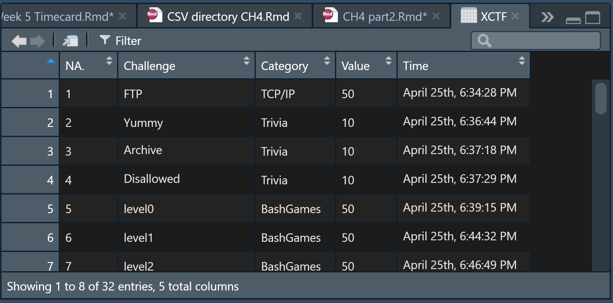
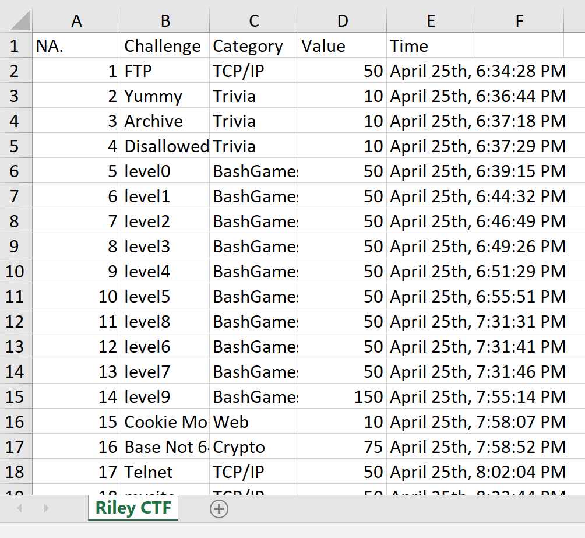
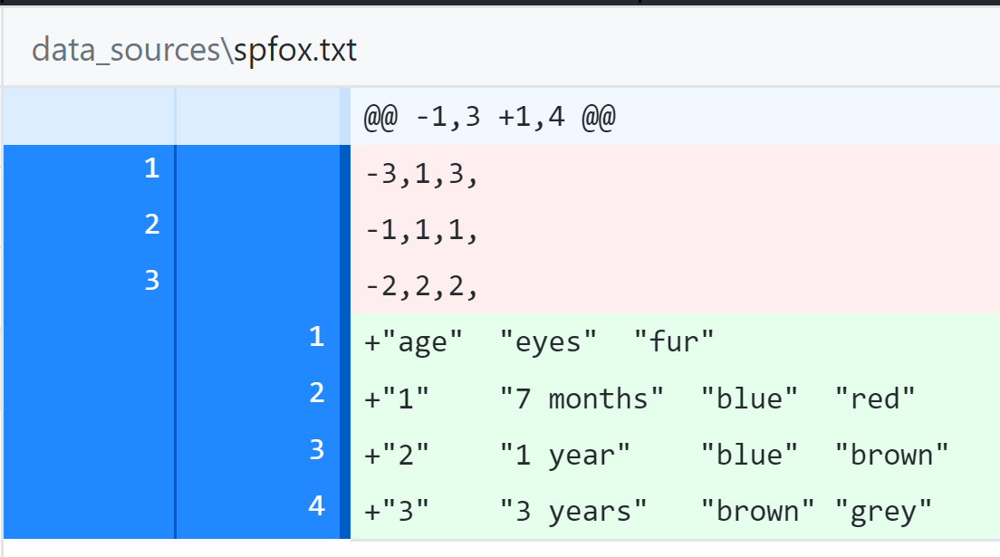

Chapter 4 part2 *Descriptive Statistics* Reading and Writing Excel and
SPSS Files, Basic Data Processing
================
Nurrospody
4/30/2020, *Learn R for Applied Statistics : With Data Visualizations,
Regressions, and Statistics*

  - [Reading an Excel File **New Commands Used:
    read.xlsx(),**](#reading-an-excel-file-new-commands-used-read.xlsx)
  - [Writing an Excel File **New Commands Used
    write.xlsx()**](#writing-an-excel-file-new-commands-used-write.xlsx)
  - [Writing an SPSS File **New Commands: write.table(),
    write.foreign()**](#writing-an-spss-file-new-commands-write.table-write.foreign)
  - [Reading an SPSS File + JSON **New Commands:
    read.spss()**](#reading-an-spss-file-json-new-commands-read.spss)
  - [Basic Data Processing **New Concepts Learned: Selecting Data;
    Select Variable with $, Sort Data (accending and descending order),
    Filtering, Removing Missing Values, Remove
    Duplicates**](#basic-data-processing-new-concepts-learned-selecting-data-select-variable-with-sort-data-accending-and-descending-order-filtering-removing-missing-values-remove-duplicates)

#### Reading an Excel File **New Commands Used: read.xlsx(),**

Now that I had the “xlsx” package properly unpacked and required, I
could start trying to read an .*xlsx* file. Once I fixed my working
directory to be data\_sources (I changed my default working directory to
data\_sources, since changing it manually each time was annoying; I
should figure out how projects work, though.), I could read the file.  
It looks similar to the *.csv* file when opened, key differences being
the addition of an NA column that has the number of each row . . . and
slightly wider spacing between values.

``` read
XCTF <- read.xlsx(file="ctf_performance.xlsx", 1);
```



#### Writing an Excel File **New Commands Used write.xlsx()**

``` write
write.xlsx(data.frame(XCTF), file ="ctf_performance.xlsx", sheetName = "Riley CTF", col.names = TRUE, row.names = FALSE);
```

 With this command I wrote to the *.xlxs*
file. GitHub desktop then tells me the binary file has changed.
Previously the first sheet was only called Sheet1; now it is named.

#### Writing an SPSS File **New Commands: write.table(), write.foreign()**

An SPSS (Statistical Package for the Social Sciences) file actually uses
the *.sav* file extension. Reading it into R necessitates installing the
“foreign” package, requiring the foreign package, and then assigning a
variable using the read.spss command.  
I didn’t have a *.sav* file lying around, so I wrote my own.

``` r
require(foreign)
```

    ## Loading required package: foreign

``` r
library(foreign)
fur <- c("red", "brown", "grey")
eyes <- c("blue", "blue", "brown")
age <- c("7 months", "1 year", "3 years")
foxes <- data.frame(age, eyes, fur)
write.table(foxes, "spfox.txt", sep = "\t")
write.foreign(foxes, "spfox.txt", "spfox.sav", package = "SPSS")
print(foxes);
```

    ##        age  eyes   fur
    ## 1 7 months  blue   red
    ## 2   1 year  blue brown
    ## 3  3 years brown  grey

Rather than writing a data.frame all in one line, I assigned all the
variables *first* and then assigned it to a data.frame. This felt much
less clunky than the previous way I made a data.frame. Then I wrote that
table to a *.txt* file, and wrote that data to a *.sav* file.  
[LINK](https://github.com/Nurrospody/SOURCE-Statistics-ILC/blob/master/data_sources/spfox.sav)
to the *.sav* file. It looks very satisfying with all its new fancy
headers\!

#### Reading an SPSS File + JSON **New Commands: read.spss()**

Technically reading an SPSS file should work exactly the same as an xlsx
or csv file, but I had some issues getting it to work, mostly because of
errors.

``` spss
require(foreign)
fox2 <- read.spss(file="../data_sources/spfox.sav", to data.frame = TRUE);
```

I tried read.spss using the .sav file format, .spss format, .sps format,
even the .txt format, but I always got this type of error: Error in
read.spss(file = “spfox.sav”, to.data.frame = TRUE) : file ‘spfox.sav’
is not in any supported SPSS format  
I’m not sure what’s up, especially since it knits perfectly fine in my
Rmd file. It also seems to change my .txt and .sav files to something
they’re not supposed to be:  
 It was originally what’s in green, but
trying to fox2 \<- read.spss(file) changed both the .txt and the .sav to
what’s in the red. I’m not sure why that’s what it became. Luckily I
caught it fast enough to both fix it in-console, and catch a screenshot
of the incorrect data.  
I’ll revisit it later when it’s more important.  
I also installed the “rjason” package as per the book section. It uses
the same read and require function as everything else.

#### Basic Data Processing **New Concepts Learned: Selecting Data; Select Variable with $, Sort Data (accending and descending order), Filtering, Removing Missing Values, Remove Duplicates**

For these excercises, I used the CTF dataset I received from my partner.

``` r
CTF <- read.csv(file="../data_sources/ctf_performance.csv", header=TRUE, sep=',')
CTF;
```

    ##     X              Challenge  Category Value                    Time
    ## 1   1                    FTP    TCP/IP    50  April 25th, 6:34:28 PM
    ## 2   2                  Yummy    Trivia    10  April 25th, 6:36:44 PM
    ## 3   3               Archive     Trivia    10  April 25th, 6:37:18 PM
    ## 4   4             Disallowed    Trivia    10  April 25th, 6:37:29 PM
    ## 5   5                 level0 BashGames    50  April 25th, 6:39:15 PM
    ## 6   6                 level1 BashGames    50  April 25th, 6:44:32 PM
    ## 7   7                 level2 BashGames    50  April 25th, 6:46:49 PM
    ## 8   8                 level3 BashGames    50  April 25th, 6:49:26 PM
    ## 9   9                 level4 BashGames    50  April 25th, 6:51:29 PM
    ## 10 10                 level5 BashGames    50  April 25th, 6:55:51 PM
    ## 11 11                 level8 BashGames    50  April 25th, 7:31:31 PM
    ## 12 12                 level6 BashGames    50  April 25th, 7:31:41 PM
    ## 13 13                 level7 BashGames    50  April 25th, 7:31:46 PM
    ## 14 14                 level9 BashGames   150  April 25th, 7:55:14 PM
    ## 15 15         Cookie Monster       Web    10  April 25th, 7:58:07 PM
    ## 16 16            Base Not 64    Crypto    75  April 25th, 7:58:52 PM
    ## 17 17                 Telnet    TCP/IP    50  April 25th, 8:02:04 PM
    ## 18 18                 mysite    TCP/IP    50  April 25th, 8:23:44 PM
    ## 19 19                mysite2    TCP/IP    50  April 25th, 8:29:30 PM
    ## 20 20                 BotNet    TCP/IP    50  April 25th, 8:46:34 PM
    ## 21 21 Time to go waaaay back     Recon    50  April 25th, 9:15:51 PM
    ## 22 22    BashNinja's Network    TCP/IP   100  April 25th, 9:25:26 PM
    ## 23 23              oink_oink    Crypto    50  April 25th, 9:29:47 PM
    ## 24 24          Zesty's Recon     Recon    50 April 25th, 10:44:55 PM
    ## 25 25         The Invisibles    Crypto    50 April 25th, 11:09:46 PM
    ## 26 26             A new Look Forensics    75 April 25th, 11:18:30 PM
    ## 27 27             This is it Forensics   100 April 25th, 11:21:35 PM
    ## 28 28     Look into the past Forensics   200 April 25th, 11:47:48 PM
    ## 29 29        DeveloperSecret       Web    10 April 25th, 11:50:11 PM
    ## 30 30             StopTheBot       Web    25 April 25th, 11:50:37 PM
    ## 31 31          Ajax Not Soap       Web    25 April 25th, 11:52:58 PM
    ## 32 32                Console       Web    50 April 25th, 11:59:09 PM

Then I **selected data** to view only the fields I was most interested
in.

``` r
CTF[, c("Value", "Time")];
```

    ##    Value                    Time
    ## 1     50  April 25th, 6:34:28 PM
    ## 2     10  April 25th, 6:36:44 PM
    ## 3     10  April 25th, 6:37:18 PM
    ## 4     10  April 25th, 6:37:29 PM
    ## 5     50  April 25th, 6:39:15 PM
    ## 6     50  April 25th, 6:44:32 PM
    ## 7     50  April 25th, 6:46:49 PM
    ## 8     50  April 25th, 6:49:26 PM
    ## 9     50  April 25th, 6:51:29 PM
    ## 10    50  April 25th, 6:55:51 PM
    ## 11    50  April 25th, 7:31:31 PM
    ## 12    50  April 25th, 7:31:41 PM
    ## 13    50  April 25th, 7:31:46 PM
    ## 14   150  April 25th, 7:55:14 PM
    ## 15    10  April 25th, 7:58:07 PM
    ## 16    75  April 25th, 7:58:52 PM
    ## 17    50  April 25th, 8:02:04 PM
    ## 18    50  April 25th, 8:23:44 PM
    ## 19    50  April 25th, 8:29:30 PM
    ## 20    50  April 25th, 8:46:34 PM
    ## 21    50  April 25th, 9:15:51 PM
    ## 22   100  April 25th, 9:25:26 PM
    ## 23    50  April 25th, 9:29:47 PM
    ## 24    50 April 25th, 10:44:55 PM
    ## 25    50 April 25th, 11:09:46 PM
    ## 26    75 April 25th, 11:18:30 PM
    ## 27   100 April 25th, 11:21:35 PM
    ## 28   200 April 25th, 11:47:48 PM
    ## 29    10 April 25th, 11:50:11 PM
    ## 30    25 April 25th, 11:50:37 PM
    ## 31    25 April 25th, 11:52:58 PM
    ## 32    50 April 25th, 11:59:09 PM

Then I **selected a variable** with $ to view it. I discovered that I
can select multiple variables in this way, but doing so looks slightly
different than selecting data.

``` r
CTF$Challenge;
```

    ##  [1] FTP                    Yummy                  Archive               
    ##  [4] Disallowed             level0                 level1                
    ##  [7] level2                 level3                 level4                
    ## [10] level5                 level8                 level6                
    ## [13] level7                 level9                 Cookie Monster        
    ## [16] Base Not 64            Telnet                 mysite                
    ## [19] mysite2                BotNet                 Time to go waaaay back
    ## [22] BashNinja's Network    oink_oink              Zesty's Recon         
    ## [25] The Invisibles         A new Look             This is it            
    ## [28] Look into the past     DeveloperSecret        StopTheBot            
    ## [31] Ajax Not Soap          Console               
    ## 32 Levels: A new Look Ajax Not Soap Archive  ... Zesty's Recon

``` r
CTF$Challenge;CTF$Category
```

    ##  [1] FTP                    Yummy                  Archive               
    ##  [4] Disallowed             level0                 level1                
    ##  [7] level2                 level3                 level4                
    ## [10] level5                 level8                 level6                
    ## [13] level7                 level9                 Cookie Monster        
    ## [16] Base Not 64            Telnet                 mysite                
    ## [19] mysite2                BotNet                 Time to go waaaay back
    ## [22] BashNinja's Network    oink_oink              Zesty's Recon         
    ## [25] The Invisibles         A new Look             This is it            
    ## [28] Look into the past     DeveloperSecret        StopTheBot            
    ## [31] Ajax Not Soap          Console               
    ## 32 Levels: A new Look Ajax Not Soap Archive  ... Zesty's Recon

    ##  [1] TCP/IP    Trivia    Trivia    Trivia    BashGames BashGames BashGames
    ##  [8] BashGames BashGames BashGames BashGames BashGames BashGames BashGames
    ## [15] Web       Crypto    TCP/IP    TCP/IP    TCP/IP    TCP/IP    Recon    
    ## [22] TCP/IP    Crypto    Recon     Crypto    Forensics Forensics Forensics
    ## [29] Web       Web       Web       Web      
    ## Levels: BashGames Crypto Forensics Recon TCP/IP Trivia Web

Next I **sorted the data**. By default, the data is in asccending order.
Descending can be done if it is specified TRUE.

``` r
CTF[order(CTF$Value), ];
```

    ##     X              Challenge  Category Value                    Time
    ## 2   2                  Yummy    Trivia    10  April 25th, 6:36:44 PM
    ## 3   3               Archive     Trivia    10  April 25th, 6:37:18 PM
    ## 4   4             Disallowed    Trivia    10  April 25th, 6:37:29 PM
    ## 15 15         Cookie Monster       Web    10  April 25th, 7:58:07 PM
    ## 29 29        DeveloperSecret       Web    10 April 25th, 11:50:11 PM
    ## 30 30             StopTheBot       Web    25 April 25th, 11:50:37 PM
    ## 31 31          Ajax Not Soap       Web    25 April 25th, 11:52:58 PM
    ## 1   1                    FTP    TCP/IP    50  April 25th, 6:34:28 PM
    ## 5   5                 level0 BashGames    50  April 25th, 6:39:15 PM
    ## 6   6                 level1 BashGames    50  April 25th, 6:44:32 PM
    ## 7   7                 level2 BashGames    50  April 25th, 6:46:49 PM
    ## 8   8                 level3 BashGames    50  April 25th, 6:49:26 PM
    ## 9   9                 level4 BashGames    50  April 25th, 6:51:29 PM
    ## 10 10                 level5 BashGames    50  April 25th, 6:55:51 PM
    ## 11 11                 level8 BashGames    50  April 25th, 7:31:31 PM
    ## 12 12                 level6 BashGames    50  April 25th, 7:31:41 PM
    ## 13 13                 level7 BashGames    50  April 25th, 7:31:46 PM
    ## 17 17                 Telnet    TCP/IP    50  April 25th, 8:02:04 PM
    ## 18 18                 mysite    TCP/IP    50  April 25th, 8:23:44 PM
    ## 19 19                mysite2    TCP/IP    50  April 25th, 8:29:30 PM
    ## 20 20                 BotNet    TCP/IP    50  April 25th, 8:46:34 PM
    ## 21 21 Time to go waaaay back     Recon    50  April 25th, 9:15:51 PM
    ## 23 23              oink_oink    Crypto    50  April 25th, 9:29:47 PM
    ## 24 24          Zesty's Recon     Recon    50 April 25th, 10:44:55 PM
    ## 25 25         The Invisibles    Crypto    50 April 25th, 11:09:46 PM
    ## 32 32                Console       Web    50 April 25th, 11:59:09 PM
    ## 16 16            Base Not 64    Crypto    75  April 25th, 7:58:52 PM
    ## 26 26             A new Look Forensics    75 April 25th, 11:18:30 PM
    ## 22 22    BashNinja's Network    TCP/IP   100  April 25th, 9:25:26 PM
    ## 27 27             This is it Forensics   100 April 25th, 11:21:35 PM
    ## 14 14                 level9 BashGames   150  April 25th, 7:55:14 PM
    ## 28 28     Look into the past Forensics   200 April 25th, 11:47:48 PM

``` r
CTF[order(CTF$Value, decreasing = TRUE), ];
```

    ##     X              Challenge  Category Value                    Time
    ## 28 28     Look into the past Forensics   200 April 25th, 11:47:48 PM
    ## 14 14                 level9 BashGames   150  April 25th, 7:55:14 PM
    ## 22 22    BashNinja's Network    TCP/IP   100  April 25th, 9:25:26 PM
    ## 27 27             This is it Forensics   100 April 25th, 11:21:35 PM
    ## 16 16            Base Not 64    Crypto    75  April 25th, 7:58:52 PM
    ## 26 26             A new Look Forensics    75 April 25th, 11:18:30 PM
    ## 1   1                    FTP    TCP/IP    50  April 25th, 6:34:28 PM
    ## 5   5                 level0 BashGames    50  April 25th, 6:39:15 PM
    ## 6   6                 level1 BashGames    50  April 25th, 6:44:32 PM
    ## 7   7                 level2 BashGames    50  April 25th, 6:46:49 PM
    ## 8   8                 level3 BashGames    50  April 25th, 6:49:26 PM
    ## 9   9                 level4 BashGames    50  April 25th, 6:51:29 PM
    ## 10 10                 level5 BashGames    50  April 25th, 6:55:51 PM
    ## 11 11                 level8 BashGames    50  April 25th, 7:31:31 PM
    ## 12 12                 level6 BashGames    50  April 25th, 7:31:41 PM
    ## 13 13                 level7 BashGames    50  April 25th, 7:31:46 PM
    ## 17 17                 Telnet    TCP/IP    50  April 25th, 8:02:04 PM
    ## 18 18                 mysite    TCP/IP    50  April 25th, 8:23:44 PM
    ## 19 19                mysite2    TCP/IP    50  April 25th, 8:29:30 PM
    ## 20 20                 BotNet    TCP/IP    50  April 25th, 8:46:34 PM
    ## 21 21 Time to go waaaay back     Recon    50  April 25th, 9:15:51 PM
    ## 23 23              oink_oink    Crypto    50  April 25th, 9:29:47 PM
    ## 24 24          Zesty's Recon     Recon    50 April 25th, 10:44:55 PM
    ## 25 25         The Invisibles    Crypto    50 April 25th, 11:09:46 PM
    ## 32 32                Console       Web    50 April 25th, 11:59:09 PM
    ## 30 30             StopTheBot       Web    25 April 25th, 11:50:37 PM
    ## 31 31          Ajax Not Soap       Web    25 April 25th, 11:52:58 PM
    ## 2   2                  Yummy    Trivia    10  April 25th, 6:36:44 PM
    ## 3   3               Archive     Trivia    10  April 25th, 6:37:18 PM
    ## 4   4             Disallowed    Trivia    10  April 25th, 6:37:29 PM
    ## 15 15         Cookie Monster       Web    10  April 25th, 7:58:07 PM
    ## 29 29        DeveloperSecret       Web    10 April 25th, 11:50:11 PM

Data can be sorted by **multiple variables** as well, but I think it’s
pretty clear that R doesn’t by default read these time values correctly.

``` r
CTF[order(CTF$Value, CTF$Time, decreasing = TRUE), ];
```

    ##     X              Challenge  Category Value                    Time
    ## 28 28     Look into the past Forensics   200 April 25th, 11:47:48 PM
    ## 14 14                 level9 BashGames   150  April 25th, 7:55:14 PM
    ## 22 22    BashNinja's Network    TCP/IP   100  April 25th, 9:25:26 PM
    ## 27 27             This is it Forensics   100 April 25th, 11:21:35 PM
    ## 16 16            Base Not 64    Crypto    75  April 25th, 7:58:52 PM
    ## 26 26             A new Look Forensics    75 April 25th, 11:18:30 PM
    ## 23 23              oink_oink    Crypto    50  April 25th, 9:29:47 PM
    ## 21 21 Time to go waaaay back     Recon    50  April 25th, 9:15:51 PM
    ## 20 20                 BotNet    TCP/IP    50  April 25th, 8:46:34 PM
    ## 19 19                mysite2    TCP/IP    50  April 25th, 8:29:30 PM
    ## 18 18                 mysite    TCP/IP    50  April 25th, 8:23:44 PM
    ## 17 17                 Telnet    TCP/IP    50  April 25th, 8:02:04 PM
    ## 13 13                 level7 BashGames    50  April 25th, 7:31:46 PM
    ## 12 12                 level6 BashGames    50  April 25th, 7:31:41 PM
    ## 11 11                 level8 BashGames    50  April 25th, 7:31:31 PM
    ## 10 10                 level5 BashGames    50  April 25th, 6:55:51 PM
    ## 9   9                 level4 BashGames    50  April 25th, 6:51:29 PM
    ## 8   8                 level3 BashGames    50  April 25th, 6:49:26 PM
    ## 7   7                 level2 BashGames    50  April 25th, 6:46:49 PM
    ## 6   6                 level1 BashGames    50  April 25th, 6:44:32 PM
    ## 5   5                 level0 BashGames    50  April 25th, 6:39:15 PM
    ## 1   1                    FTP    TCP/IP    50  April 25th, 6:34:28 PM
    ## 32 32                Console       Web    50 April 25th, 11:59:09 PM
    ## 25 25         The Invisibles    Crypto    50 April 25th, 11:09:46 PM
    ## 24 24          Zesty's Recon     Recon    50 April 25th, 10:44:55 PM
    ## 31 31          Ajax Not Soap       Web    25 April 25th, 11:52:58 PM
    ## 30 30             StopTheBot       Web    25 April 25th, 11:50:37 PM
    ## 15 15         Cookie Monster       Web    10  April 25th, 7:58:07 PM
    ## 4   4             Disallowed    Trivia    10  April 25th, 6:37:29 PM
    ## 3   3               Archive     Trivia    10  April 25th, 6:37:18 PM
    ## 2   2                  Yummy    Trivia    10  April 25th, 6:36:44 PM
    ## 29 29        DeveloperSecret       Web    10 April 25th, 11:50:11 PM

Data can be **filtered with boolean expressions**. Here I filtered to
find only flags that were worth more than 10 points, only withihn the
first 19 flags earned. I was impressed to see quite a lot\! It’s also
easy to see that within the first 19, there were only 2 scores above 50.

``` r
CTF[CTF$Value > 10 & CTF$X < 20, ];
```

    ##     X   Challenge  Category Value                   Time
    ## 1   1         FTP    TCP/IP    50 April 25th, 6:34:28 PM
    ## 5   5      level0 BashGames    50 April 25th, 6:39:15 PM
    ## 6   6      level1 BashGames    50 April 25th, 6:44:32 PM
    ## 7   7      level2 BashGames    50 April 25th, 6:46:49 PM
    ## 8   8      level3 BashGames    50 April 25th, 6:49:26 PM
    ## 9   9      level4 BashGames    50 April 25th, 6:51:29 PM
    ## 10 10      level5 BashGames    50 April 25th, 6:55:51 PM
    ## 11 11      level8 BashGames    50 April 25th, 7:31:31 PM
    ## 12 12      level6 BashGames    50 April 25th, 7:31:41 PM
    ## 13 13      level7 BashGames    50 April 25th, 7:31:46 PM
    ## 14 14      level9 BashGames   150 April 25th, 7:55:14 PM
    ## 16 16 Base Not 64    Crypto    75 April 25th, 7:58:52 PM
    ## 17 17      Telnet    TCP/IP    50 April 25th, 8:02:04 PM
    ## 18 18      mysite    TCP/IP    50 April 25th, 8:23:44 PM
    ## 19 19     mysite2    TCP/IP    50 April 25th, 8:29:30 PM

I could **omit NA data**, but there is no data to omit.

``` omit
na.omit(CTF);
```

Lastly, I can **remote duplicate values**. This isn’t terribly useful
for this dataset, but we can easily see that there’s 7 different point
values.

``` r
CTF[!duplicated(CTF$Value), ];
```

    ##     X           Challenge  Category Value                    Time
    ## 1   1                 FTP    TCP/IP    50  April 25th, 6:34:28 PM
    ## 2   2               Yummy    Trivia    10  April 25th, 6:36:44 PM
    ## 14 14              level9 BashGames   150  April 25th, 7:55:14 PM
    ## 16 16         Base Not 64    Crypto    75  April 25th, 7:58:52 PM
    ## 22 22 BashNinja's Network    TCP/IP   100  April 25th, 9:25:26 PM
    ## 28 28  Look into the past Forensics   200 April 25th, 11:47:48 PM
    ## 30 30          StopTheBot       Web    25 April 25th, 11:50:37 PM

Once I did all of these excercises, I noticed that my report wasn’t
knitting properly–it wasn’t printing anything. In my RMarkdown tab on
the RConsole, there were a bunch of messages about unknown language
engines for knitting . . . I had gotten tired of writing r inside of
every {} that I had to name my code blocks with, because nothing
mentioned to me that it was neccesary. But the error messages I got led
me to believe it is neccesary:

``` note
1: In get_engine(options$engine) :
  Unknown language engine 'wrsps' (must be registered via knit_engines$set()).
```

This revealed some interesting things to me:  
1\. If I wanted to write in a different language than R, I could do so
as long as I registered it.  
2\. Having the wrong language means that knit will not catch any errors
I’ve made, which is bad for checking my work.  
3\. But because it will not catch any errors I make, if I want to write
anything inside of a codeblock but not have it actually be code . . . I
can simply fail to specify the language. There’s probably other, more
professionally appropriate ways to do this.

I fixed this by adding r into the {} names of of code blocks, and now it
is printing succesfully. Code blocks that I mentioned “will come back to
later” for, I left it untouched.

To continue reading the CH4 reports, select a new section:  
[Part 3 of the Chapter 4
Reports](https://github.com/Nurrospody/SOURCE-Statistics-ILC/blob/master/Chapter%20Reports/CH4-part2.md)  
[Link to README to select any Chapter
Report](https://github.com/Nurrospody/SOURCE-Statistics-ILC/blob/master/README.md)
