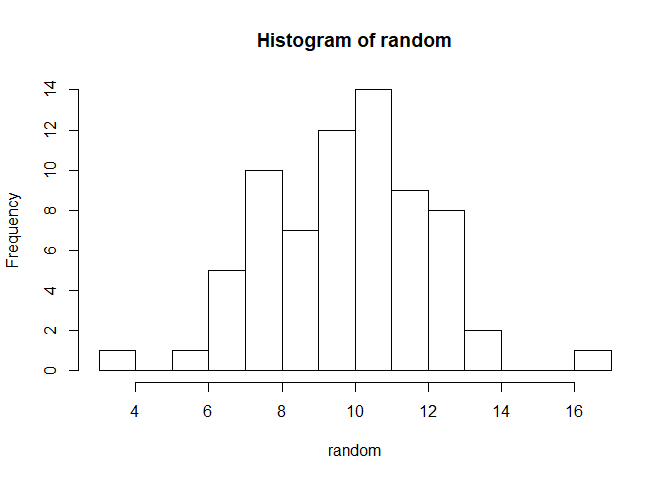
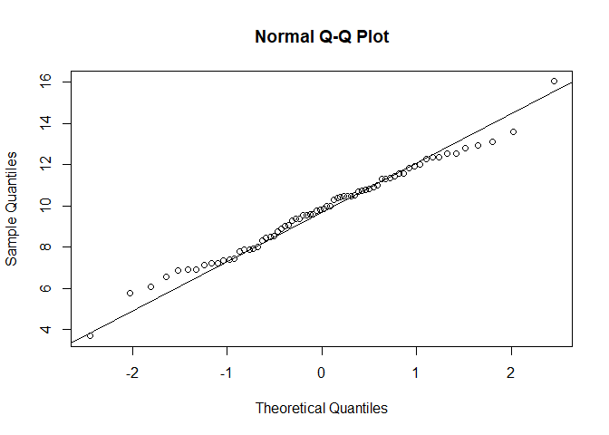

Chapter 4 part3 *Descriptive Statistics* Mode, Median, Mean
================
Nurrospody
5/3/2020, *Learn R for Applied Statistics : With Data Visualizations,
Regressions, and Statistics*

  - [Generating a Number Set **New Commands Used: set.seed(), rnorm(),
    hist(), qqnorm(), qqline(),
    shapiro.test()**](#generating-a-number-set-new-commands-used-set.seed-rnorm-hist-qqnorm-qqline-shapiro.test)
  - [Central Tendency, Spread, Variation Commands that DON’T require
    manual help **New Commands Used: median(), mean(), range(), diff(),
    res \<- , min(), max(), IQR(), quantile(), var(),
    sd()**](#central-tendency-spread-variation-commands-that-dont-require-manual-help-new-commands-used-median-mean-range-diff-res---min-max-iqr-quantile-var-sd)

#### Generating a Number Set **New Commands Used: set.seed(), rnorm(), hist(), qqnorm(), qqline(), shapiro.test()**

Before doing any of the excercises, I read ahead in the Basic Statistics
part of chapter 4. I noticed that most of these excercises wanted a big
number dataset, and it was helpful if the dataset was normally
distributed. So I went a bit out of order and **generated a number set**
first.

``` r
set.seed(NULL);
random <- rnorm(70, 10, 2);
print(random)
```

    ##  [1] 10.878255  5.643165 11.683776  8.279260 11.549956 11.451955 13.370179
    ##  [8] 10.126731 12.099745  8.602582 10.558754  7.607298 10.149068  8.545950
    ## [15]  9.987197 13.289800  7.721351 11.804366 11.831994  9.634737  8.090798
    ## [22] 13.836986 10.657932 12.408304  8.364120 11.008095 11.685643  6.369396
    ## [29]  9.098848  8.716103  7.660327  9.551009  9.414104  8.148395  8.034997
    ## [36]  6.614911 10.817276 10.446656  9.024702 10.376004  6.113105 12.530452
    ## [43] 12.784498 11.903985  7.879825 16.181668  7.781156  8.429211 12.680340
    ## [50] 10.170073 10.101167 10.096625  9.973559  8.226119 11.953782  9.205164
    ## [57] 10.213702 10.617300  9.773205  9.469419  7.342926 11.705558  7.693870
    ## [64]  9.000892 10.919303 10.051282 12.677293 10.281020 10.718778 10.811127

Originally I tried using system.time rather than NULL to set my seed, to
guarentee the randomness of it, but I discovered this in the
help(set.seed) documentation:

``` set
"Initially, there is no seed; a new one is created from the current time and the process ID when one is required. Hence different sessions will give different simulation results, by default. However, the seed might be restored from a previous session if a previously saved workspace is restored."
```

This means that I don’t have to manually use system.time to make
reliably random seeds, and can use NULL with good conscience. I talked
with my partner a bit about the consequences of having non-random seeds,
or duplicate-able seeds: in Monster Hunter 3 Ultimate, it was always
best to set your birthday to a specific day (like January 15th or
something) *because the seed for that day* had end-game drop tables that
were objectively better than any other drop tables in the game. This led
to all serious players either having to live with subpar tables, or
restarting their entire game to set a fake birthday. Players with this
birthday had an unfair unknown advantage over all over players, merely
because of the seed they received. Bad seeds cause strife in video
games, but the strife they cause in the real world is so much worse.

Whenever I knit my document, I get a new random data set (which is
wonderful) which I believe further proves that these seeds are good.

Then I made a histogram of my random numbers, to verify randomness:

``` r
hist(random, breaks=10);
```

<!-- --> Based on the random
number set that was generated each knit, this histogram ranges from a
disastogram to being almost perfect. So I ran some more tests to prove
randomness.  
First, a **Q-Q plot**:

``` r
qqnorm(random)
qqline(random)
```

<!-- --> Sometimes, this looks
textbook perfect. Othertimes it’s a bit more wobbly on the very edges.

Then I ran a Shapiro-Wilk normality test.

``` r
shapiro.test(random)
```

    ## 
    ##  Shapiro-Wilk normality test
    ## 
    ## data:  random
    ## W = 0.98865, p-value = 0.7822

Between knits I’ve gotten the pleasure of seeing p-values that are low
like 0.1408, or p-values that are quite high like 0.7505. Assuming the
‘default’ alpha of 0.05, all of these p-values mean I can reject the
null hypothesis. (In this case, the null hypothesis is that variable
‘random’ equals a non-random distribution). I am not certain what the
W represents, but it seems to gravitate between 0.97\#\#\# and
0.98\#\#\#.

Now that I have an ever changing, lovely random data set to work with,
let’s go back to th beginning of the chapter and run some more basic
commands.

#### Central Tendency, Spread, Variation Commands that DON’T require manual help **New Commands Used: median(), mean(), range(), diff(), res \<- , min(), max(), IQR(), quantile(), var(), sd()**

Medians indicate the 50% percentile and can be better than the mean for
centrality IF there are many outliers or the data is skewed, such as
American economic data.

``` r
median(random)
```

    ## [1] 10.11395

Means are the mathemetical average–sum all the data, then divide it by
N. The mean is good for centrality when data’s distribution is normal or
flat.

``` r
mean(random)
```

    ## [1] 10.03467

Range is the difference between the largest and smallest data point.
range() gives us the largest and the smallest without subtracting them.
If we want the difference, we need to specify that. Min and max values
can also be useful for finding ranges.

``` r
range(random)
```

    ## [1]  5.643165 16.181668

``` r
res <- range(random); diff(res)
```

    ## [1] 10.5385

``` r
min(random); max(random)
```

    ## [1] 5.643165

    ## [1] 16.18167

Interquartile Ranges are useful for looking at the spread of data. IQR
gives us the difference between the 75% quartile and 25% quartile–most
of the data will be here.  
We can also request the main 4 quartiles, or specify any quartile.

``` r
IQR(random)
```

    ## [1] 3.06706

``` r
quantile(random); quantile(random, 0.30)
```

    ##        0%       25%       50%       75%      100% 
    ##  5.643165  8.458396 10.113949 11.525456 16.181668

    ##      30% 
    ## 8.915455

SAMPLE variance can be found with the var() function. POPULARION
variance requires more care.

``` r
var(random)
```

    ## [1] 4.004074

SAMPLE standard deviation can be found with the sd() function.
POPULATION sd requires more care.

``` r
sd(random)
```

    ## [1] 2.001018

To continue reading the CH4 reports, select a new section:  
[Part 4 of the Chapter 4 Reports (DOES NOT EXIST
YET)](https://github.com/Nurrospody/SOURCE-Statistics-ILC/blob/master/Chapter%20Reports/CH4-part4.md)  
[Link to README to select any Chapter
Report](https://github.com/Nurrospody/SOURCE-Statistics-ILC/blob/master/README.md)
