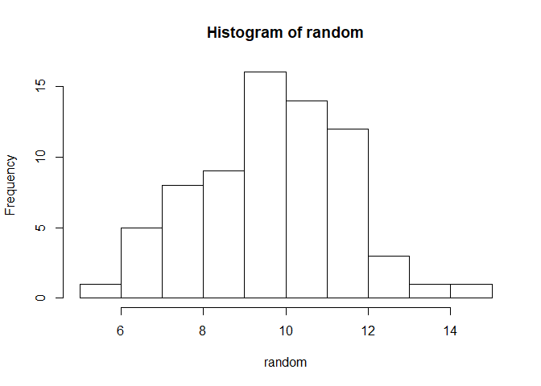
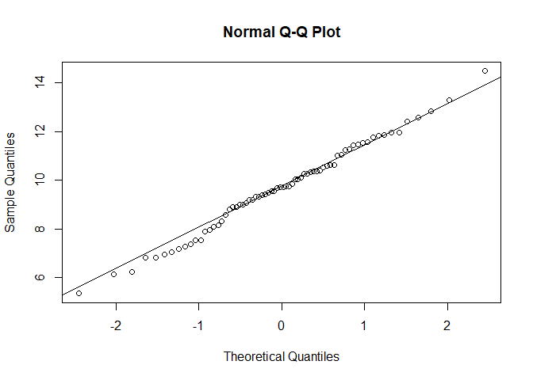

Chapter 4 part3 *Descriptive Statistics* Central Tendency, Spread,
Variation Commands, Random Number Generation
================
Nurrospody
5/3/2020, *Learn R for Applied Statistics : With Data Visualizations,
Regressions, and Statistics*

  - [Generating a Number Set **New Commands Used: set.seed(), rnorm(),
    hist(), qqnorm(), qqline(),
    shapiro.test()**](#generating-a-number-set-new-commands-used-set.seed-rnorm-hist-qqnorm-qqline-shapiro.test)
  - [Central Tendency, Spread, Variation Commands that DON’T require
    manual help **New Commands Used: median(), mean(), range(), diff(),
    res \<- , min(), max(), IQR(), quantile(), var(),
    sd()**](#central-tendency-spread-variation-commands-that-dont-require-manual-help-new-commands-used-median-mean-range-diff-res---min-max-iqr-quantile-var-sd)
  - [Central Tendency, Spread, Variation Commands that DO require manual
    help](#central-tendency-spread-variation-commands-that-do-require-manual-help)

#### Generating a Number Set **New Commands Used: set.seed(), rnorm(), hist(), qqnorm(), qqline(), shapiro.test()**

Before doing any of the excercises, I read ahead in the Basic Statistics
part of chapter 4. I noticed that most of these excercises wanted a big
number dataset, and it was helpful if the dataset was normally
distributed. So I went a bit out of order and **generated a number set**
first.

``` r
set.seed(NULL);
random <- rnorm(70, 10, 2);
print(random)
```

    ##  [1]  9.826494  9.065310  8.814595  8.563254  9.382763 11.256545  8.981788
    ##  [8]  7.361516 10.039361  6.961752 11.243033 10.394685  6.130403  7.972492
    ## [15]  7.043358  9.411424 10.266041  9.703351  5.347325 11.055905 12.422719
    ## [22]  7.522149 10.371153 10.614395 10.509950 10.262291  8.145225 11.941964
    ## [29]  9.175873 10.616995  8.993539 11.437810  8.311521  9.757576  6.225241
    ## [36] 11.946885 11.849535  7.269068 10.997243 10.601334  9.337078  8.895220
    ## [43]  9.203705 11.454376  7.526863  8.101565  9.543737 13.300003 10.360707
    ## [50]  9.734457 11.825338 12.836642 10.038241 14.471561 10.329705 11.748632
    ## [57]  9.314330  7.907735  9.541246 10.087124  6.817062 11.534361 11.559121
    ## [64]  7.188120 12.558816  9.693330  6.805177  9.467936  9.711676  8.907838

Originally I tried using system.time rather than NULL to set my seed, to
guarentee the randomness of it, but I discovered this in the
help(set.seed) documentation:

``` set
"Initially, there is no seed; a new one is created from the current time and the process ID when one is required. Hence different sessions will give different simulation results, by default. However, the seed might be restored from a previous session if a previously saved workspace is restored."
```

This means that I don’t have to manually use system.time to make
reliably random seeds, and can use NULL with good conscience. I talked
with my partner a bit about the consequences of having non-random seeds,
or duplicate-able seeds:

``` mh3u
In Monster Hunter 3 Ultimate, it was always best to set your birthday to a specific day (like January 15th or something) *because the seed for that day* had end-game drop tables that were objectively better than any other drop tables in the game.  This led to all serious players either having to live with subpar tables, or restarting their entire game to set a fake birthday.  Players with this birthday had an unfair unknown advantage over all over players, merely because of the seed they received.
```

Bad seeds cause strife in video games, but the strife they cause in the
real world is so much worse.

Whenever I knit my document, I get a new random data set (which is
wonderful) which I believe further proves that these seeds are good.
This also means that with every commit to GitHub for this report, my
values are changed.

Then I made a histogram of my random numbers, to verify randomness:

``` r
hist(random, breaks=10);
```

<!-- -->

Based on the random number set that was generated each knit, this
histogram ranges from a disastogram to being almost perfect. So I ran
some more tests to prove randomness.  
First, a **Q-Q plot**:

``` r
qqnorm(random)
qqline(random)
```

<!-- -->

Sometimes, this looks textbook perfect. Othertimes it’s a bit more
wobbly on the very edges.

Then I ran a Shapiro-Wilk normality test.

``` r
shapiro.test(random)
```

    ## 
    ##  Shapiro-Wilk normality test
    ## 
    ## data:  random
    ## W = 0.99264, p-value = 0.9574

Between knits I’ve gotten the pleasure of seeing p-values that are low
like 0.1408, or p-values that are quite high like 0.8921. There’s also
been . . . hall of shame results with p values around 0.02.  
Assuming the ‘default’ alpha of 0.05, *most* of these p-values mean I
can reject the null hypothesis. (In this case, the null hypothesis is
that variable ‘random’ equals a non-random distribution). I am not
certain what the W represents, but it seems to gravitate between
0.97\#\#\# and 0.98\#\#\#. Hall of shame results sometimes have
0.96\#\#\# values.

Now that I have an ever changing, lovely random data set to work with,
let’s go back to th beginning of the chapter and run some more basic
commands.

#### Central Tendency, Spread, Variation Commands that DON’T require manual help **New Commands Used: median(), mean(), range(), diff(), res \<- , min(), max(), IQR(), quantile(), var(), sd()**

Medians indicate the 50% percentile and can be better than the mean for
centrality IF there are many outliers or the data is skewed, such as
American economic data.

``` r
median(random)
```

    ## [1] 9.707514

Means are the mathemetical average–sum all the data, then divide it by
N. The mean is good for centrality when data’s distribution is normal or
flat.

``` r
mean(random)
```

    ## [1] 9.679937

Range is the difference between the largest and smallest data point.
range() gives us the largest and the smallest without subtracting them.
If we want the difference, we need to specify that. Min and max values
can also be useful for finding ranges.

``` r
range(random)
```

    ## [1]  5.347325 14.471561

``` r
res <- range(random); diff(res)
```

    ## [1] 9.124236

``` r
min(random); max(random)
```

    ## [1] 5.347325

    ## [1] 14.47156

Interquartile Ranges are useful for looking at the spread of data. IQR
gives us the difference between the 75% quartile and 25% quartile–most
of the data will be here.  
We can also request the main 4 quartiles, or specify any quartile.

``` r
IQR(random)
```

    ## [1] 2.276092

``` r
quantile(random); quantile(random, 0.30)
```

    ##        0%       25%       50%       75%      100% 
    ##  5.347325  8.626090  9.707514 10.902181 14.471561

    ##      30% 
    ## 8.959603

SAMPLE variance can be found with the var() function. POPULARION
variance requires more care.

``` r
var(random)
```

    ## [1] 3.374527

SAMPLE standard deviation can be found with the sd() function.
POPULATION sd requires more care.

``` r
sd(random)
```

    ## [1] 1.836989

#### Central Tendency, Spread, Variation Commands that DO require manual help

There is no built-in function in *R* for **Mode**. One way (the book
given way) to get the mode is this:

``` 1
Make variable; x <- table(variable)
names(x)[which(x==max(x))];
```

Whereby you request the names of which elements/values there are the
most of, but only after turning your matrix/data.frame into a frequency
table. This returned weird things and didn’t seem to ignore duplicate
values, so I didn’t like it very much.

You can also make or find a pre-made function for finding mode, as to
not enter the formula every time.

``` r
Modes <- function(x) {
  ux <- unique(x)
  tab <- tabulate(match(x, ux))
  ux[tab == max(tab)]
}
```

*Modes* is a function for finding all the given modes in a variable, if
there are multiple. “Modes” is capitalized because mode() is a seperate
built-in function.  
*Unique* removes duplicate elements from our result. This is useful for
mode because we want to know that our mode is, say, 5, and not 5, 5, 5,
5, 5.  
*Tabulate* counts the number of times each integer happens in a vector
bin.  
*Max* does the same thing as the previous function–which value occurs
the maximum amount of times?

If we tried to get the mode from our variable “random” right now, it
would just return every variable because each number with 6 decimal
points *is* unique, and each occurs the most frequently at one time.  
Instead, let’s use the built-in R function which unfortunately shares
names with the mathematical mode, but instead is for changing the ‘mode’
(data type) of a value/variable.

``` r
mode(random) <- "integer"
print(random)
```

    ##  [1]  9  9  8  8  9 11  8  7 10  6 11 10  6  7  7  9 10  9  5 11 12  7 10 10 10
    ## [26] 10  8 11  9 10  8 11  8  9  6 11 11  7 10 10  9  8  9 11  7  8  9 13 10  9
    ## [51] 11 12 10 14 10 11  9  7  9 10  6 11 11  7 12  9  6  9  9  8

Now instead of having 70 unique values, we have a much more limited
scope of values. Hooray\! Let’s run Modes() on this:

``` r
Modes(random)
```

    ## [1] 9

I learned here that while FUNCTION names are caps sensitive, LABELS for
code blocks are NOT caps sensitive. Thanks Windows.

To continue reading the CH4 reports, select a new section:  
[Part 4 of the Chapter 4
Reports](https://github.com/Nurrospody/SOURCE-Statistics-ILC/blob/master/Chapter%20Reports/CH4-part4.md)  
[Link to README to select any Chapter
Report](https://github.com/Nurrospody/SOURCE-Statistics-ILC/blob/master/README.md)
