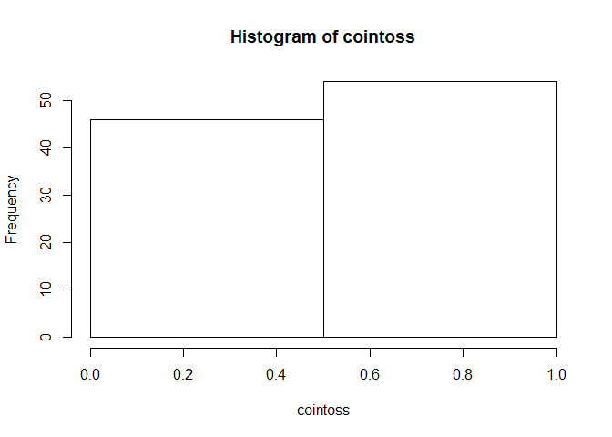
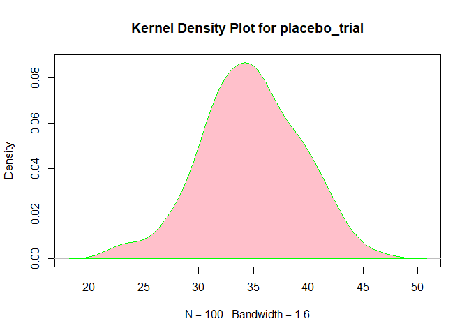

Chapter 4 part5 *Descriptive Statistics* Binomial Distribution
================
Nurrospody
5/11/2020, *Learn R for Applied Statistics : With Data Visualizations,
Regressions, and Statistics*

  - [Binomial Distribution **New Commands: dbinom(), pbinom(), qbinom(),
    rbinom()**](#binomial-distribution-new-commands-dbinom-pbinom-qbinom-rbinom)
  - [Summary and Structure **summary(),
    str()**](#summary-and-structure-summary-str)

#### Binomial Distribution **New Commands: dbinom(), pbinom(), qbinom(), rbinom()**

If we want to test for the distribution of whether things DID or DID NOT
work, binomial distributions are what we should use. Binomial
distributions are based on if a result is TRUE or FALSE; normally we
test for if a SUCCESS is true or false. For this distribution we need to
know how probable a success is; how many trials there are, and how many
successes *per trial* there are.

The **dbinom()** function tests how likely it is to get *exactly one
result*.

``` r
dbinom(70, 100, 0.69)
```

    ## [1] 0.08476678

In a single trial with 100 samples and a 69% chance for success, how
likely is it that there will be exactly 70 successes? Now, an 8.4%
chance to get that single datapoint out of 100 isn’t very low. If we did
not know the probability, this would be a hint that 70 is near the
mean.  
It’s more likely that we want to find the **pbinom()** instead, which
will tell us the probability of getting any number of successes from 0
all the way to 70. (X \<= 70) This will give us a more widely useful
number:

``` r
pbinom(70, 100, 0.69)
```

    ## [1] 0.622368

Now, we see that there is a 62.23% chance of getting 70 (or less)
successes. This shows us that 70 successes are about average.  
What if we wanted to know *exactly* what number marks the 50% center of
this binomial distribution? We can use **qbinom**:

``` r
qbinom(0.5, 100, 0.69); qbinom(.3, 100, 0.69)
```

    ## [1] 69

    ## [1] 67

We see here that we’re 50% likely to get 69 successes out of 100 trials,
when a success is 69% likely. This result shows us that if we use a
sample size and probability divisible by base-10, we can easily get our
mean just by looking at the probability.  
I also tested for what we’re 30% likely to see–it’s not very far off, at
67 successes.

**rbinom()** is a little bit different; it can generate numbers to
simulate a new dataset, should we tell it to repeat a trial X amount of
times, with x samples per trial, and p probability of a success. We can
then turn that simulated dataset into a histogram. This could help us
detect bias or errors in our real dataset, if the simulated dataset is
too different from what we keep collecting.  
I’ve simulated two datasets:  
**1.** If I flip a single coin 100 times, it is 50% likely to land on
either side.

``` r
cointoss <- rbinom(100, 1, 0.5); cointoss
```

    ##   [1] 0 0 0 1 1 0 1 1 0 0 0 1 1 0 0 0 1 1 1 1 1 1 1 1 0 0 0 0 1 1 0 1 1 1 0 0 1
    ##  [38] 0 0 1 1 0 0 0 1 0 1 1 1 0 1 1 1 0 0 0 0 1 0 1 0 0 0 1 0 1 1 1 1 1 0 1 0 0
    ##  [75] 1 1 1 1 1 0 1 1 0 1 0 1 0 0 1 1 0 1 0 0 1 1 1 0 0 1

``` r
hist(cointoss, breaks=2)
```

<!-- --> **2.** A
doctor is repeating a trial 100 times, with 70 (new) patients each time.
He is testing a placebo, which has a 50% to make the patient feel
different than they did before. How many patients, for each trial,
report feeling different? (Bonus kernel density plot).

``` r
placebo_trial <- rbinom(100, 70, 0.5)
hist(placebo_trial, breaks=10)
```

<!-- -->

``` r
d <- density(placebo_trial)
plot(d, main="Kernel Density Plot for placebo_trial")
polygon(d, col="pink", border="green") 
```

<!-- -->

#### Summary and Structure **summary(), str()**

Chapter 4, descriptive statistics, ends on these two commands, but I’ve
already used them both before, so I’m a little confused as to why
they’re here.

``` r
summary(placebo_trial)
```

    ##    Min. 1st Qu.  Median    Mean 3rd Qu.    Max. 
    ##   23.00   32.00   35.00   34.79   38.00   46.00

``` r
summary(PlantGrowth)
```

    ##      weight       group   
    ##  Min.   :3.590   ctrl:10  
    ##  1st Qu.:4.550   trt1:10  
    ##  Median :5.155   trt2:10  
    ##  Mean   :5.073            
    ##  3rd Qu.:5.530            
    ##  Max.   :6.310

``` r
testBdata <- rbinom(70, 100, 0.69); summary(testBdata)
```

    ##    Min. 1st Qu.  Median    Mean 3rd Qu.    Max. 
    ##   58.00   67.25   70.00   69.60   72.00   79.00

I’ve included **summaries** from the “placebo\_trial” example earlier, a
built-in dataset called “PlantGrowth” I discovered by happy accident,
and a summary for the test B(inomial) data I used earlier in the report.

These are the **structures** of the same datasets as above.

``` r
str(placebo_trial)
```

    ##  int [1:100] 23 35 31 28 36 28 36 40 41 39 ...

``` r
str(PlantGrowth)
```

    ## 'data.frame':    30 obs. of  2 variables:
    ##  $ weight: num  4.17 5.58 5.18 6.11 4.5 4.61 5.17 4.53 5.33 5.14 ...
    ##  $ group : Factor w/ 3 levels "ctrl","trt1",..: 1 1 1 1 1 1 1 1 1 1 ...

``` r
str(testBdata)
```

    ##  int [1:70] 63 67 71 70 75 70 75 71 70 71 ...

This is the last section of the CH4 reports. [Link to README to select
any Chapter
Report](https://github.com/Nurrospody/SOURCE-Statistics-ILC/blob/master/README.md)
