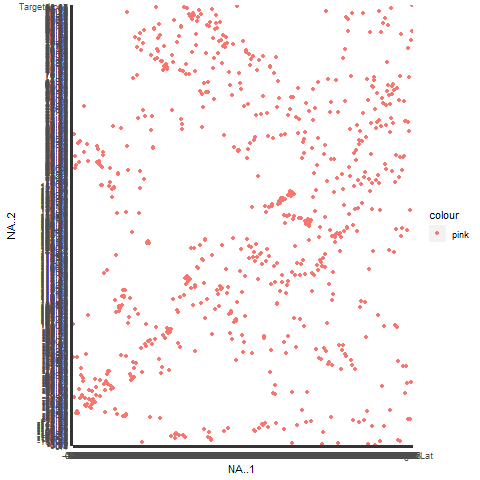
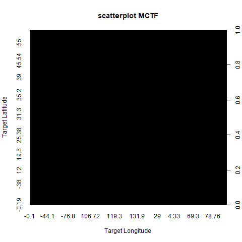
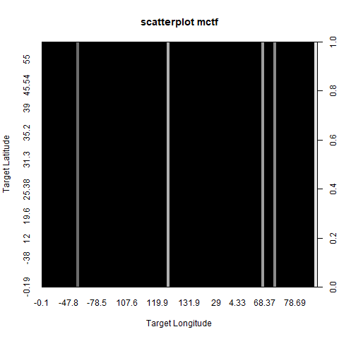

```{r setup, include=FALSE}
knitr::opts_chunk$set(echo = TRUE)
```

First, I read through the whole chapter to give myself an idea of what I'd be doing.  Roughly: the first half of the chapter goes over built-in R data visualization tools . . . and then the second half goes over a superior way to do data visualization i.e. using ggplot2.  ggplot2 is more complicated and requires/needs downloaded quite a few packages (including packages it depends on).  If you only need a quick-and-dirty data visualization, or are doing something for a personal project, the built in tools are fine.  Otherwise, ggplot2 seems better for professional application, so I'll start out by getting the packages for that.

That's a lot of packages!!  I don't want to wait for that to unpack every time I knit this document, so I'll just show it off in cleartext here.
```
>install.packages("ggplot2")
Installing package into ‘C:/Users/Persimmon/Documents/R/win-library/3.6’
(as ‘lib’ is unspecified)
also installing the dependencies ‘ps’, ‘processx’, ‘callr’, ‘prettyunits’, ‘backports’, ‘desc’, ‘pkgbuild’, ‘rprojroot’, ‘rstudioapi’, ‘pkgload’, ‘praise’, ‘colorspace’, ‘assertthat’, ‘utf8’, ‘testthat’, ‘farver’, ‘labeling’, ‘lifecycle’, ‘munsell’, ‘R6’, ‘RColorBrewer’, ‘viridisLite’, ‘cli’, ‘crayon’, ‘ellipsis’, ‘fansi’, ‘pillar’, ‘pkgconfig’, ‘vctrs’, ‘gtable’, ‘isoband’, ‘scales’, ‘tibble’, ‘withr’
``` 
It then checked URLs for each package, and then unpacked and checked an "MD5 sums" for each.

ggplot can only take data in the form of a data.frame.  This means that if I wanted to chart like I did before: making a random seed and a normal distribution of that, I'd have to assign the distribution to a variable, and then put the variable in a data.frame.  So all things using ggplot2 should start with ```ggplot(data)```, and then the rest of the information follows.

ggplot2 uses aes() to show 'aesthetics', or the everything we see within a plot.  Variables need to be set to X or Y with the aes() function, so that graphics read correctly.

Different types of charts are "geometric objects" within ggplot2.  Those many types of charts can be looked up with ```help.search("geom_", package="ggplot2");```

```
Help pages:
ggplot2::geom_abline		Reference lines: horizontal, vertical, and diagonal
ggplot2::geom_bar		Bar charts
ggplot2::geom_bin2d		Heatmap of 2d bin counts
ggplot2::geom_blank		Draw nothing
ggplot2::geom_boxplot		A box and whiskers plot (in the style of Tukey)
ggplot2::geom_contour		2d contours of a 3d surface
ggplot2::geom_count		Count overlapping points
ggplot2::geom_density		Smoothed density estimates
ggplot2::geom_density_2d		Contours of a 2d density estimate
ggplot2::geom_dotplot		Dot plot
ggplot2::geom_errorbarh		Horizontal error bars
ggplot2::geom_hex		Hexagonal heatmap of 2d bin counts
ggplot2::geom_freqpoly		Histograms and frequency polygons
ggplot2::geom_jitter		Jittered points
ggplot2::geom_crossbar		Vertical intervals: lines, crossbars & errorbars
ggplot2::geom_map		Polygons from a reference map
ggplot2::geom_path		Connect observations
ggplot2::geom_point		Points
ggplot2::geom_polygon		Polygons
ggplot2::geom_qq_line		A quantile-quantile plot
ggplot2::geom_quantile		Quantile regression
ggplot2::geom_ribbon		Ribbons and area plots
ggplot2::geom_rug		Rug plots in the margins
ggplot2::geom_segment		Line segments and curves
ggplot2::geom_smooth		Smoothed conditional means
ggplot2::geom_spoke		Line segments parameterised by location, direction and distance
ggplot2::geom_label		Text
ggplot2::geom_raster		Rectangles
ggplot2::geom_violin		Violin plot
ggplot2::CoordSf		Visualise sf objects
ggplot2::update_geom_defaults		Modify geom/stat aesthetic defaults for future plots
```

First, I obtained a new dataset: "[Launch_data.xlsx](https://github.com/Nurrospody/SOURCE-Statistics-ILC/blob/master/data_sources/Launch_data.xlsx)".  [TXT format](https://github.com/Nurrospody/SOURCE-Statistics-ILC/blob/master/data_sources/MCTF.txt).  I obtined this dataset from my partner, who participated in the Kaizen CTF and got this dataset from a sheet within an Excel file.  It's simmulated data of: if soneone got far enough into the CTF, they could launch a nerf gun bullet from a Raspberry Pi.  It contains 8 columns of numeric "factor" class data.  I had to double check if the last column was numeric or logical, since it was just 0s and 1s so it seemed like it could be both.  
```
> class(mCTF)
[1] "data.frame"
> class(MCTF$NA..6)
[1] "factor"
> class(MCTF$NA..5)
[1] "factor"
```
I worked with 3 data.frames of this data, in reaction to the graphs acting kind of strange (I thought it was in reaction to the size of the data)  
MCTF ```> MCTF <- read.xlsx(file="Launch_data.xlsx", 1)``` The whole thing  
mCTF ```> mCTF <- MCTF[1:30,]``` Only the first 30 entries in each column  
mctf ```> mctf <- MCTF[1:5,];``` Only the first 5 entries in each column  

Let's look at geom_point, which makes a ggplot2 scatter plot.  Let's also look at the built-in scatter plot function, plot().

If I use a ggplot2 geom_point and try to plot all 755 observations of X (the target latitude) and Y (the target longitude), I get a glitchy looking side where the values should be.  This is because I haven't specified to ggplot2 what scale I want my labels to be on.  Here, I'm showing what I typed in the console in order to export my graph as a png file, and then showing that png file.
```
> png(file="MCTF_point.png");
> ggplot(MCTF, aes(x=NA..1, y=NA..2)) + geom_point(aes(color="pink"));
> dev.off();
RStudioGD 
        2 
```


 I didn't actually find a way inside of my book to specify the axis scale, but I did find [THIS](http://www.sthda.com/english/wiki/ggplot2-axis-scales-and-transformations) page about axis scales & transformations on STHDA.  It looks like I can change the min and max of the X and Y axis with ```sp + xlim(min, max)+ylim(min, max)``` and change the axis limits ```sp + expand_limits(x=c(0,30), y=c(0, 150))```.  But looking at my data, the range isn't actually that big--it looks like it's just that the plot is trying to include every point on it.  
 What I want to actually use is ```scale_x_continuous```, ```scale_y_continuous```, or maybe ```scale_x_discrete```?  Or maybe ```labs()```or ```lims()```. . . I found some help in help(labs) and [THIS](https://stackoverflow.com/questions/14428887/overflowing-x-axis-ggplot2) thread, but this seems to get deeper into depth of ggplot2 than my introduction to it should be right this second.  It looks pretty complicated, but people are making lots of cool looking charts with ggplot2.  

The very first thing I tried doing before I looked into all of that axis management, though, was plotting mCTF (instead of MCTF).  I also labeled this one!  But I also discovered that my color wasn't working correctly; I thought my pink seemed awfully red before.  Inside of the book, the colors don't work correctly either, so finding a function to "not automatically assign colors" might be required.  
I also discovered that windows does not have CAPS SENSITIVE file names.  Thanks Windows.  
```
> png(file="m2CTF_point.png");
> ggplot(mCTF, aes(x=NA..2, y=NA..1)) + geom_point(aes(color="blue")) + labs(title="Scatter of Nerf Gun Target Lat/Lon", x = "Target Longitude", y = "Target Latitude", color="Color Key");
> dev.off();
RStudioGD 
        2 
```


This 'solution' isn't optimal (I'd still want to show all my data in a real report) and the bottom is still crowded, but the Y axis labels look much better.  

The built-in R function, plot(), didn't do much better with this data, but for different reasons.  It takes a very long time for the plot to run, and when it's finished it looks like this . . .
```
> png(file="MCTF_plot")
> plot(MCTF$NA..2, MCTF$NA..1, xlab="Target Longitude", ylab="Target Latitude", main="scatterplot");
> dev.off()
RStudioGD 
        2 
```


It's kind of a disaster and I'm not sure why it's just a solid black box.  "mCTF" also results in a box like this, and "mctf" is a solid black box with some white lines.  It's like the dimensions of the dots are messed up.  Oddly though, R's built in scatterplot is better at scaling the X and Y axis with no interference than ggplot2.




To continue reading the CH5 reports, select a new section:  
[Part 2 of the Chapter 5 EMPTY LINK
Reports](https://github.com/Nurrospody/SOURCE-Statistics-ILC/blob/master/Chapter%20Reports/CH5-part2.md)  
[Link to README to select any Chapter
Report](https://github.com/Nurrospody/SOURCE-Statistics-ILC/blob/master/README.md)