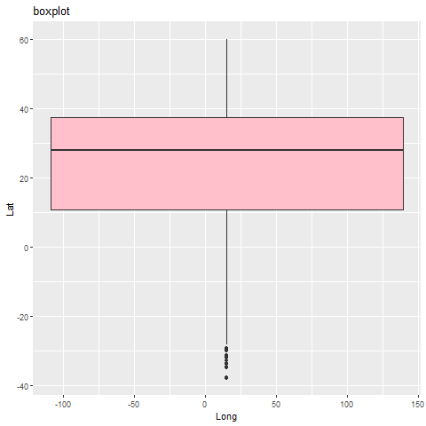

```{r setup, include=FALSE}
knitr::opts_chunk$set(echo = TRUE)
```

#### Boxplot (Built into R type)  **New: boxplot()**
For the boxplot, I used the same dataset as before (MCTF) but I changed the file first.  My headers were not very descriptive before, at ```NA..1``` through ```NA..8```.  I discovered this is because there were some random notes in the top row above only two of the columns, so HEADER=TRUE wasn't working very well.  I deleted those notes, and then I then used SaveAs to make the new file Launch_DataHEADER.  That way I don't mess up my old report.  
The new XLSX file can be found [HERE](https://github.com/Nurrospody/SOURCE-Statistics-ILC/blob/master/data_sources/Launch_dataHEADER.xlsx)".  

Now my MCTF variable uses the new file.  ```> MCTF <- read.xlsx(file="Launch_dataHEADER.xlsx", 1)```

My MCTF data.frame has 9 variables.  I tried making a boxplot with all 9 variables first.
```
> boxplot(MCTF, main="boxplot", notch=FALSE, varwidth=TRUE,
+ col=c("green", "purple", "blue", "pink", "red", "yellow", "orange", "gray", "brown"))
```


Only some labels on the X axis are present, so this boxplot doesn't really make any sense.  I didn't expect it to with 9 variables of such different scale: this was just an experiment.   
So next I assigned 3 variables from the data.frame.
```
> Lat <- MCTF$Target.Lat
> Long <- MCTF$Target.Long
> TrajAng <- MCTF$Trajectory.Angle
```
I made those variables into their own data.frame of just 3 variables, ```> LatLongTraj <- data.frame(Lat, Long, TrajAng);``` and made a boxplot of those.

```
> boxplot(LatLongTraj, main="boxplot", notch=FALSE, varwidth=TRUE,
+ col=c("orange", "pink", "gray"))
```


This boxplot is more sensible and we can see that there's more variation in the Longitude than the Latitude or Trajectory Angle.  Remember that the context of this is setting a nerf gun to shoot at something from a raspberry pi, so it makes sense that the Longitude has the most variation.  

#### Boxplot (ggplot2 type)  **New: geom_boxplot**

What if we use ggplot2 to make a boxplot?  Well the issue I ran into was grouping, or at least I believe that's the issue, because the plot does not have 3 boxes but only 1.  ggplot2 makes [default groups](https://www.gl-li.com/2017/08/13/ggplot2-group-overrides-default-grouping/).
```
> ggplot(LatLongTraj, aes(y=Lat, x=Long)) + geom_boxplot(fill="pink") + labs(title="boxplot");
Warning message:
Continuous x aesthetic -- did you forget aes(group=...)? 
``` 


At least I get a warning about an aes(group).  But unfortunately, I don't know what this boxplot is telling me due to this default grouping?  
I tried just adding more ```fill=``` colours, since that made sense, but I didn't get success out of that.  
```
> ggplot(LatLongTraj, aes(y=Lat)) + geom_boxplot(fill="pink", "grey", "orange") + labs(title="boxplot");
Error: `mapping` must be created by `aes()`
Run `rlang::last_error()` to see where the error occurred.
```
Running rlang::last_error() results in a backtrace that I guess tells me what part of the function went wrong:
```
<error/rlang_error>
`mapping` must be created by `aes()`
Backtrace:
 1. ggplot2::geom_boxplot(fill = "pink", "grey", "orange")
 2. ggplot2::layer(...)
 3. ggplot2:::validate_mapping(mapping)
Run `rlang::last_trace()` to see the full context.
> rlang::last_trace()
<error/rlang_error>
`mapping` must be created by `aes()`
Backtrace:
    x
 1. \-ggplot2::geom_boxplot(fill = "pink", "grey", "orange")
 2.   \-ggplot2::layer(...)
 3.     \-ggplot2:::validate_mapping(mapping)
> 
```
I tried just adding ```+ aes(group=Lat, Long, TrajAng)``` into the string because it made sense, right?  And I got a hillariously strange boxplot:


Weirdly enough, I kind of recognize this.  This is like the scatterplot that I made earlier, but with boxes everywhere reprsenting how much data is on those spots.  

I've come to the conclusion that ggplot2 doing funky things like this is why Chapter 5 of my book goes over a bunch of data visualization techniques *before* it even mentions ggplot2, and then it only goes over a very basic understanding of ggplot2.  I might spend some more time looking into it during the small break between quarters.

#### Scatterplot Matrix (Built into R type)  **New: pairs()**
Scatterplot matrixes are read like a punnet square, but the labels are within the matrix instead of on the side.  (For matrixes, the scale is on the side, since it's still a table).  What we're looking for, is for data to be more concentrated together.  When data is more concentrated together, we can conclude that the vatiables effect each other and are not totally independent.  
Let's make a table with the Latitude, Longitude, and Trajectory Angle of our nerf gun MCTF data.  
```
> png(file="MCTF_matrix.png")
> pairs(~Lat+Long+TrajAng, data=LatLongTraj, main="scatterplot
+ matrix");
> dev.off()
 ```


What we can tell from this is that where Longitude and Trajectory angle intersect, and where Trajectory angle and Longitude intersect, the data has more correlation than the other data.  Something's Latitude does not inform its Longitude (that matrix is pretty wild and spread out), nor does something's Latitude inform its Trajectory Angle.  (However, the Latitude might inform its *Bearing Angle*, which is another datapoint I haven't done much with).  


To continue reading the CH5 reports, select a new section:  
[CURRENTLY NA Part 3 of the Chapter 5 Reports](https://github.com/Nurrospody/SOURCE-Statistics-ILC/blob/master/Chapter%20Reports/CH5-part3.md)  
[Link to README to select any Chapter
Report](https://github.com/Nurrospody/SOURCE-Statistics-ILC/blob/master/README.md)