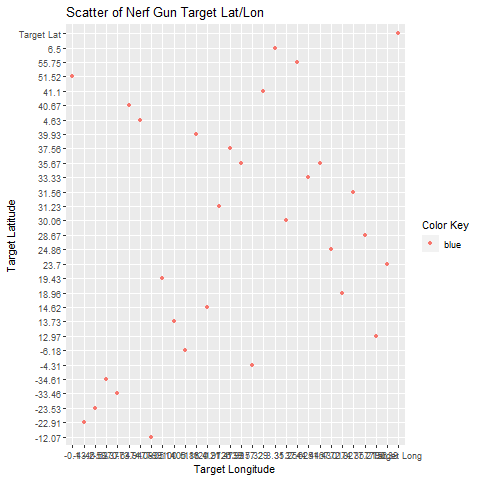
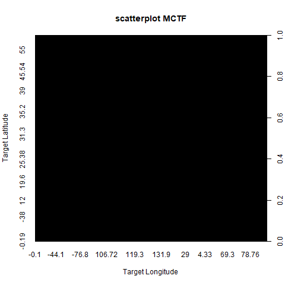

Chapter 5 part1 *Data Visualizations* ggplot2 intro; geom\_point; plot()
================
Nurrospody
5/14/2020, *Learn R for Applied Statistics : With Data Visualizations,
Regressions, and Statistics*

  - [Unpacking ggplot2](#unpacking-ggplot2)
  - [The New Dataset](#the-new-dataset)
  - [Scatterplots in ggplot2 **New: geom\_point, png(file=), ggplot(),
    dev.off()**](#scatterplots-in-ggplot2-new-geom_point-pngfile-ggplot-dev.off)
  - [Scatterplots with plot() *Noteworthy: plot(),
    as.integer()*](#scatterplots-with-plot-noteworthy-plot-as.integer)

First, I read through the whole chapter to give myself an idea of what
I’d be doing. The first half of the chapter goes over built-in R data
visualization tools . . . and then the second half goes over a superior
way to do data visualization i.e. using ggplot2. ggplot2 is more
complicated and also needs a lot of packages to be downloaded (including
packages it depends on). If you only need a quick-and-dirty data
visualization, or are doing something for a personal project, the built
in tools should be fine. Otherwise, ggplot2 seems better for
professional application, so I’ll start out by getting the packages for
that.

#### Unpacking ggplot2

That’s a lot of packages\!\! I don’t want to wait for that to unpack
every time I knit this document, so I’ll just show it off in cleartext
here.

    >install.packages("ggplot2")
    Installing package into ‘C:/Users/Persimmon/Documents/R/win-library/3.6’
    (as ‘lib’ is unspecified)
    also installing the dependencies ‘ps’, ‘processx’, ‘callr’, ‘prettyunits’, ‘backports’, ‘desc’, ‘pkgbuild’, ‘rprojroot’, ‘rstudioapi’, ‘pkgload’, ‘praise’, ‘colorspace’, ‘assertthat’, ‘utf8’, ‘testthat’, ‘farver’, ‘labeling’, ‘lifecycle’, ‘munsell’, ‘R6’, ‘RColorBrewer’, ‘viridisLite’, ‘cli’, ‘crayon’, ‘ellipsis’, ‘fansi’, ‘pillar’, ‘pkgconfig’, ‘vctrs’, ‘gtable’, ‘isoband’, ‘scales’, ‘tibble’, ‘withr’

It then checked URLs for each package, and then unpacked and checked an
“MD5 sums” for each.

ggplot can only take data in the form of a data.frame. This means that
if I wanted to visualize a randomized dataset, I’d have to assign the
resulting distribution to a variable, and then put the variable in a
data.frame (This is as apposed to just assigning whatever results random
seed to a variable).  
All things using ggplot2 should start with `ggplot(data)`, and then the
rest of the information follows.

ggplot2 uses aes() to show ‘aesthetics’, or the everything we see within
a plot. Variables need to be set to X or Y with the aes() function, so
that graphics read correctly. There are many complicated aes() within
ggplot2.

Different types of charts are “geometric objects” within ggplot2. Those
many types of charts can be looked up with `help.search("geom_",
package="ggplot2");`

    Help pages:
    ggplot2::geom_abline        Reference lines: horizontal, vertical, and diagonal
    ggplot2::geom_bar       Bar charts
    ggplot2::geom_bin2d     Heatmap of 2d bin counts
    ggplot2::geom_blank     Draw nothing
    ggplot2::geom_boxplot       A box and whiskers plot (in the style of Tukey)
    ggplot2::geom_contour       2d contours of a 3d surface
    ggplot2::geom_count     Count overlapping points
    ggplot2::geom_density       Smoothed density estimates
    ggplot2::geom_density_2d        Contours of a 2d density estimate
    ggplot2::geom_dotplot       Dot plot
    ggplot2::geom_errorbarh     Horizontal error bars
    ggplot2::geom_hex       Hexagonal heatmap of 2d bin counts
    ggplot2::geom_freqpoly      Histograms and frequency polygons
    ggplot2::geom_jitter        Jittered points
    ggplot2::geom_crossbar      Vertical intervals: lines, crossbars & errorbars
    ggplot2::geom_map       Polygons from a reference map
    ggplot2::geom_path      Connect observations
    ggplot2::geom_point     Points
    ggplot2::geom_polygon       Polygons
    ggplot2::geom_qq_line       A quantile-quantile plot
    ggplot2::geom_quantile      Quantile regression
    ggplot2::geom_ribbon        Ribbons and area plots
    ggplot2::geom_rug       Rug plots in the margins
    ggplot2::geom_segment       Line segments and curves
    ggplot2::geom_smooth        Smoothed conditional means
    ggplot2::geom_spoke     Line segments parameterised by location, direction and distance
    ggplot2::geom_label     Text
    ggplot2::geom_raster        Rectangles
    ggplot2::geom_violin        Violin plot
    ggplot2::CoordSf        Visualise sf objects
    ggplot2::update_geom_defaults       Modify geom/stat aesthetic defaults for future plots

#### The New Dataset

First, I obtained a new dataset:
“[Launch\_data.xlsx](https://github.com/Nurrospody/SOURCE-Statistics-ILC/blob/master/data_sources/Launch_data.xlsx)”.
[TXT
format](https://github.com/Nurrospody/SOURCE-Statistics-ILC/blob/master/data_sources/MCTF.txt).  
I worked with 3 data.frames of this data. The reason I did this is
because my data visualization was acting strange, and my first idea was
that it had to do with the sheer quantity of data. The data.frames are
as follows:  
MCTF `> MCTF <- read.xlsx(file="Launch_data.xlsx", 1)` The whole thing  
mCTF `> mCTF <- MCTF[1:30,]` Only the first 30 entries in each column  
mctf `> mctf <- MCTF[1:5,];` Only the first 5 entries in each column

I obtined this dataset from my partner, who participated in the Kaizen
CTF and got this dataset from a sheet within an Excel file. It’s
simmulated data where someone could launch a nerf gun bullet from a
Raspberry Pi, if they got far enough into the CTF. It contains 8 columns
of numeric “factor” class data.

    #I chose to double check my claim that the last column, NA..6, was a factor . . . because it might have been TRUE/FALSE as well.
    > class(mCTF)
    [1] "data.frame"
    > class(MCTF$NA..6)
    [1] "factor"
    > class(MCTF$NA..5)
    [1] "factor"

#### Scatterplots in ggplot2 **New: geom\_point, png(file=), ggplot(), dev.off()**

Let’s look at **geom\_point**, which makes a ggplot2 scatter plot.
Later, I’ll compare it to the built-in scatter **plot** function,
plot().

If I use a ggplot2 geom\_point and try to plot all 755 observations of X
(the target latitude) and Y (the target longitude), I get a glitchy
looking side where the values should be. This is because I haven’t
specified to ggplot2 how my labels should be spaced, though I haven’t
actually found a solution to this because most issues with this seem to
be related to DATE AND TIME, not just a bunch of numbers.

Here, I’m showing what I typed in the console in order to export my
graph as a png file, and then showing that png file. The same technique
was used for all graphs in this report.

    > png(file="MCTF_point.png");
    > ggplot(MCTF, aes(x=NA..1, y=NA..2)) + geom_point(aes(color="pink"));
    > dev.off();
    RStudioGD 
            2 

My book had no information about changing axis scales, but I did some
online searching.
[THIS](http://www.sthda.com/english/wiki/ggplot2-axis-scales-and-transformations)
page about axis scales & transformations is on STHDA. It looks like I
can change the min and max of the X and Y axis with `sp + xlim(min,
max)+ylim(min, max)` and change the axis limits `sp +
expand_limits(x=c(0,30), y=c(0, 150))`. But looking at my data, the
range isn’t actually that big–it looks like it’s just that the plot is
trying to include every point on it.  
What I want to actually use is `scale_x_continuous`,
`scale_y_continuous`, or maybe `scale_x_discrete`? Or maybe `labs()`or
`lims()`?
[THIS](https://stackoverflow.com/questions/14428887/overflowing-x-axis-ggplot2)
thread offers yet more answers that aren’t *quite* pertinant to the
issue I’m running into . . . ggplot2 is quite complicated.

This axis weirdness, and not finding the solution to fix it in a timely
manner that’s conductive to an introductory overview, is why I attempted
to make the smaller versions of my dataset.

This ‘solution’ isn’t optimal (I’d still want to show all my data in a
real report) and the bottom is still crowded, but the Y axis labels look
much better. The following graph, which is improved but still far from
perfect, uses mCTF: only the first 30 entries in each column.  

    > ggplot(mCTF, aes(x=NA..2, y=NA..1)) + geom_point(aes(color="blue")) + labs(title="Scatter of Nerf Gun Target Lat/Lon", x = "Target Longitude", y = "Target Latitude", color="Color Key");

I discovered that my color wasn’t working correctly; it should have
printed as BLUE dots on the scatter, not RED. Inside of my book, the
colors don’t appear to work correctly either. Finding a different
function or aes() to “not automatically assign colors” might be
required.  
Also, Windows does not have CAPS SENSITIVE file names apparently,
because writing to mCTF changed MCTF. Thanks Windows.

#### Scatterplots with plot() *Noteworthy: plot(), as.integer()*

The built-in R function, plot(), didn’t do much better with this data.

    > png(file="MCTF_plot")
    > plot(MCTF$NA..2, MCTF$NA..1, xlab="Target Longitude", ylab="Target Latitude", main="scatterplot");
    > dev.off()
    RStudioGD 
            2 

It takes a very long time for the plot to run, and when it’s finished it
looks like this: 

It’s kind of a disaster and I’m not sure why it’s just a solid black
box. “mCTF” also results in a box like this, and “mctf” is a solid black
box with some white lines. It’s like the dimensions of the dots are
messed up. Oddly though, R’s built in scatterplot is better at scaling
the X and Y axis with no interference than ggplot2.
 

I attempted to figure out what the problem with R’s scatterplots were,
and I think it’s because of the sheer quantity of double values–and just
how BIG those double values are in the decimal.

I assigned `MCTF$NA..1` and `MCTF$NA..2` to `NC1`and `NC2` respectively.
This was so that I could manipulate the data as a vector, and not as a
data.frame.

Then, I used the `as.integer()` command to make these whole numbers.

    > NC2 <- (as.integer(NA2))
    > NC1 <- (as.integer(NA1))

Once I did this, I was able to plot the points prefectly fine.

Something very odd, however, is that even though this plot LOOKS the
same as the geom\_point graph at the beginning of this report . . . the
actual numbers within NC2 and NC1, once made as.integer, appear to be
very gross inaccurate approximations of what the numbers were. The
highest number in MCTF NA..1 was around 100; the highest number in NC2
is around 400. In the help(as.integer) section I found `(To ensure that
an object x is of integer type without stripping attributes, use
storage.mode(x) <- "integer".)` written, and so I tried using

    > storage.mode(NA1) <- "integer"
    > storage.mode(NA2) <- "integer"
    > plot(NA2, NA1, xlab="Target Longitude", ylab="Target Latitude", main="scatterplot");

However the resulting scatterplot was a black square. Using `as.integer`
on this “integer” assigned storage mode of NA1 still results in
incorrect numbers as well.

I also tried plotting without the first point, in case it was the header
causing issues `> plot(NA2[-1], NA1[-1], xlab="Target Longitude",
ylab="Target Latitude", main="scatterplot");`, plotting with
specifically the second through the last point `> plot(NA2[2:754],
NA1[2:754], xlab="Target Longitude", ylab="Target Latitude",
main="scatterplot");`, and plotting only the first 100 points excluding
the header `> plot(NA2[2:101], NA1[2:101], xlab="Target Longitude",
ylab="Target Latitude", main="scatterplot");` but none of these attempts
worked to get a proper scatterplot.

However, if I make variables with only a single double value–so one
variable with 6.8 and another with 7.4, R’s built in plot() can plot
*that*. So I haven’t quite cracked the mystery of using the plot()
function and what makes it bug out. . . but it’s a start.

UPDATE: I editted my XLSX file because it had useless (for my purposes)
data clunking up the headers. Once I could properly assign headers, and
I did the same exact thing I’d done before to try and get scatterplots,
I get this message and no scatterplot at all:

    > plot(MCTF$NA..2, MCTF$NA..1, xlab="Target Longitude", ylab="Target Latitude", main="scatterplot");
    Error in plot.window(...) : need finite 'xlim' values
    In addition: Warning messages:
    1: In min(x) : no non-missing arguments to min; returning Inf
    2: In max(x) : no non-missing arguments to max; returning -Inf
    3: In min(x) : no non-missing arguments to min; returning Inf
    4: In max(x) : no non-missing arguments to max; returning -Inf

Adding \[1:100,\] at the end of each $ (to have a finite range?) doesn’t
make any difference.

To continue reading the CH5 reports, select a new section:  
[Part 2 of the Chapter 5
Reports](https://github.com/Nurrospody/SOURCE-Statistics-ILC/blob/master/Chapter%20Reports/CH5-part2.md)  
[Link to README to select any Chapter
Report](https://github.com/Nurrospody/SOURCE-Statistics-ILC/blob/master/README.md)
