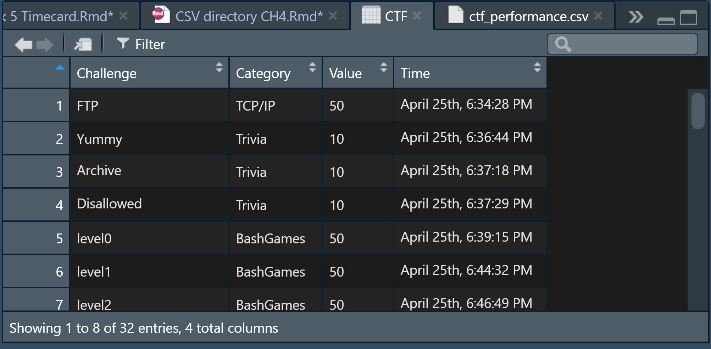

```{r setup, include=FALSE}
knitr::opts_chunk$set(echo = TRUE)
```

#### Chapter 4 Vocabulary:
**Descriptive Statistics** discuss distribution, central tendency, and data dispersion.  After we summarize a dataset with descriptive statistics, we can better decide on whether to use inferential statistics or regression analysis on the data next.  
**Inferential statistics**: can identify the relationship between SETS of data  
**Regression analysis**: can identify the relationship between VARIABLES WITHIN THE SAME SET of data.  
**Distribution** can be normal, binomial, or Bernoulli (in order of popularity).  
**Central tendency** is mean, median, and mode (which one is best depends on the dataset).  
**Data dispersion** means the spread of the data, and can be the range, variance, standard deviation, or interquartile range.  
An important question is *how normal is the data distribution*.  
**Central Limit Theorum**: the mean of a sample will be equal to the "normal distribution mean" of a sample.  This is why we 'convert' data to be normally distributed when working with it.  

#### Reading Data Files: Getting Location **New Commands used: getwd(), setwd()** 
I first learned how to get my working directory.  
```{r directory}
getwd();
```
My code-editor's working directory is my chapter reports, since this is a chapter report; my console's working directory was simply my documents.  
In order to read my *.csv* file in the next section, I changed my working directory to the data_sources directory where I store my *.csv* files.  This is shown as a comment, because I cannot change the working directory for my report and knit correctly:
```{r 2 directory}
#setwd("C:/Users/Persimmon/Documents/GitHub/Statistics-ILC/data_sources"); 
#getwd()
#[1] "C:/Users/Persimmon/Documents/GitHub/Statistics-ILC/data_sources"
```

#### Reading a CSV File **New Commands Used: read.csv()**  
Now that my working directory is set to the same location as my *.csv* files, it's easy to read.csv my *.csv* into R.  That path is shown in a comment.  
For the purpose of knitting my Rmd, the path is slightly more complicated since I must go up a level in the directory, and then to the data_sources directory.
```{r read}
#CTF <- read.csv(file="ctf_performance.csv", header=TRUE, sep=",");
CTF <- read.csv(file="../data_sources/ctf_performance.csv", header=TRUE, sep=",");
print(CTF)
```
Once I assign the *.csv* file to CTF, it becomes an R object in my global environment that I can click on, and it becomes a very nice table that looks like this:

This table is very nice, especially compared to how the same data looks if I were to simply open up the ctf_performance.cvs directly from file explorer without properly using the read.csv command:


#### Writing a CSV File **New Commands used: write.csv()**
Using write.csv, I can write to the file directly from R, which would presumably be useful if I had editted the data.
```{r write}
#write.csv(data.frame(CTF), file="ctf_performance.csv", quote=TRUE, sep=",", row.names=TRUE, col.names=TRUE);
```
My attempts to set seperators and column names were ignored, since they weren't neccesary, but when I checked out the file's properties in explorer, it had been modified and accessed!  Quotes had been placed around the name of each CTF excercise, and a row number (with quotes around it) had been appended to each entry.

#### The Adventure to Read an Excel File **New Commands Used: install.packages(), require(), library(),** installed Java and Rtools and made a Windows Environment Variale path.

First, I needed to install the "xlsx" package onto my computer, so that I could read an EXCEL file inside of R.  
```{r xl}
#install.packages("xlsx");
```

Using the pckage requires the require() function.  
*I was curious about what this is so used the help() function, and it looks like require() and library() are related.  Then I went onto a slight tangent where with library(help), I found out I could see all the downloadable libraries--including the base R library--and I can use library(help=base) to look at all commands included inthe base R package.  Super cool!*
```{r require}
#require("xlsx")
## Loading required package: xlsx

## Error: package or namespace load failed for 'xlsx':
##  .onLoad failed in loadNamespace() for 'rJava', details:
##   call: fun(libname, pkgname)
##   error: JAVA_HOME cannot be determined from the Registry
```
However, it wouldn't work.  I tried installing Rtools, since R briefly mentioned Rtools when I installed the package.

After installing Rtools for 3.6.3, I restarted R, and then tested if it worked by using this command:
```{r tools}
Sys.which("make")
```
That appears to work as intended.  Hopeful, I attempted to install the "xlsx" package again . . . I discovered that the package installer was made in Java, something that I don't have--so without Java R couldn't read the installer.

Once I installed Java and restarted my computer (again) I was finally able to succesfully 'unpack' the package!
```{r success}
#Installing package into ‘C:/Users/Persimmon/Documents/R/win-library/3.6’
#(as ‘lib’ is unspecified)
#trying URL 'https://cran.rstudio.com/bin/windows/contrib/3.6/xlsx_0.6.3.zip'
#Content type 'application/zip' length 379823 bytes (370 KB)
#downloaded 370 KB

#package ‘xlsx’ successfully unpacked and MD5 sums checked

#The downloaded binary packages are in
#	C:\Users\Persimmon\AppData\Local\Temp\RtmpEF3qjQ\downloaded_packages
```
Unfortunately, unpacking succesfully does not mean that I can succesfully load it from the registry, apparently.  The same error from my last require() attempt persisted.  
Here, my partner came to help:  
We discovered that the 32-bit version of Java was intalled on my computer; to install the 64-bit version their '[All Java Downloads](https://www.java.com/en/download/manual.jsp)' link must be found and followed.  
After installing the correct bit version of Java and  uninstalling the 32 version, we discovered that that JAVA_HOME was not a set environment variable in my windows machine. We set the variable to the correct path: Java/jre1.8.0_250.  
After all of that, require("xlsx"); finally ran correctly.
```{r finally}
require("xlsx");
```
[To continue reading the CH4 reports, select a new section.](https://github.com/Nurrospody/SOURCE-Statistics-ILC/blob/master/README.md)