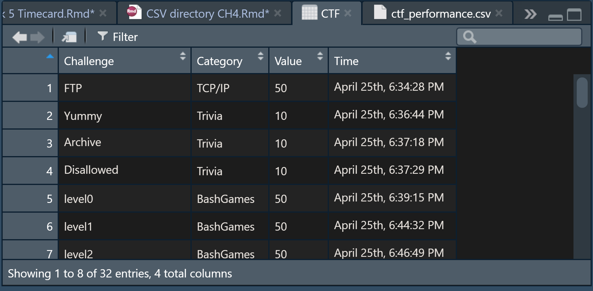
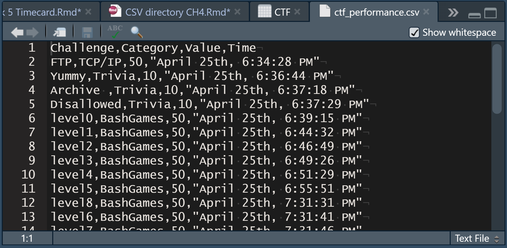

Chapter 4 *Descriptive Statistics* Working directory, *.csv*, vocabulary
================
Nurrospody
4/28/2020, *Learn R for Applied Statistics : With Data Visualizations,
Regressions, and Statistics*

  - [Chapter 4 Vocabulary:](#chapter-4-vocabulary)
  - [Reading Data Files: Getting Location **New Commands used: getwd(),
    setwd()**](#reading-data-files-getting-location-new-commands-used-getwd-setwd)
  - [Reading a CSV File **New Commands Used:
    read.csv()**](#reading-a-csv-file-new-commands-used-read.csv)
  - [Writing a CSV File **New Commands used:
    write.csv()**](#writing-a-csv-file-new-commands-used-write.csv)
  - [Reading an Excel File **New Commands Used: install.packages(),
    require(),
    library(),**](#reading-an-excel-file-new-commands-used-install.packages-require-library)
  - [R Tools Adventure](#r-tools-adventure)

#### Chapter 4 Vocabulary:

**Descriptive Statistics** discuss distribution, central tendency, and
data dispersion. After we summarize a dataset with descriptive
statistics, we can better decide on whether to use inferential
statistics or regression analysis on the data next.  
**Inferential statistics**: can identify the relationship between SETS
of data  
**Regression analysis**: can identify the relationship between VARIABLES
WITHIN THE SAME SET of data.  
**Distribution** can be normal, binomial, or Bernoulli (in order of
popularity).  
**Central tendency** is mean, median, and mode (which one is best
depends on the dataset).  
**Data dispersion** means the spread of the data, and can be the range,
variance, standard deviation, or interquartile range.  
An important question is *how normal is the data distribution*.  
**Central Limit Theorum**: the mean of a sample will be equal to the
“normal distribution mean” of a sample. This is why we ‘convert’ data
to be normally distributed when working with it.

#### Reading Data Files: Getting Location **New Commands used: getwd(), setwd()**

I first learned how to get my working directory.

``` r
getwd();
```

    ## [1] "C:/Users/Persimmon/Documents/GitHub/Statistics-ILC/Chapter Reports"

My code-editor’s working directory is my chapter reports, since this is
a chapter report; my console’s working directory was simply my
documents.  
In order to read my *.csv* file in the next section, I changed my
working directory to the data\_sources directory where I store my *.csv*
files. This is shown as a comment, because I cannot change the working
directory for my report and knit correctly:

``` r
#setwd("C:/Users/Persimmon/Documents/GitHub/Statistics-ILC/data_sources"); 
#getwd()
#[1] "C:/Users/Persimmon/Documents/GitHub/Statistics-ILC/data_sources"
```

#### Reading a CSV File **New Commands Used: read.csv()**

Now that my working directory is set to the same location as my *.csv*
files, it’s easy to read.csv my *.csv* into R. That path is shown in a
comment.  
For the purpose of knitting my Rmd, the path is slightly more
complicated since I must go up a level in the directory, and then to the
data\_sources directory.

``` r
#CTF <- read.csv(file="ctf_performance.csv", header=TRUE, sep=",");
CTF <- read.csv(file="../data_sources/ctf_performance.csv", header=TRUE, sep=",");
print(CTF)
```

    ##     X              Challenge  Category Value                    Time
    ## 1   1                    FTP    TCP/IP    50  April 25th, 6:34:28 PM
    ## 2   2                  Yummy    Trivia    10  April 25th, 6:36:44 PM
    ## 3   3               Archive     Trivia    10  April 25th, 6:37:18 PM
    ## 4   4             Disallowed    Trivia    10  April 25th, 6:37:29 PM
    ## 5   5                 level0 BashGames    50  April 25th, 6:39:15 PM
    ## 6   6                 level1 BashGames    50  April 25th, 6:44:32 PM
    ## 7   7                 level2 BashGames    50  April 25th, 6:46:49 PM
    ## 8   8                 level3 BashGames    50  April 25th, 6:49:26 PM
    ## 9   9                 level4 BashGames    50  April 25th, 6:51:29 PM
    ## 10 10                 level5 BashGames    50  April 25th, 6:55:51 PM
    ## 11 11                 level8 BashGames    50  April 25th, 7:31:31 PM
    ## 12 12                 level6 BashGames    50  April 25th, 7:31:41 PM
    ## 13 13                 level7 BashGames    50  April 25th, 7:31:46 PM
    ## 14 14                 level9 BashGames   150  April 25th, 7:55:14 PM
    ## 15 15         Cookie Monster       Web    10  April 25th, 7:58:07 PM
    ## 16 16            Base Not 64    Crypto    75  April 25th, 7:58:52 PM
    ## 17 17                 Telnet    TCP/IP    50  April 25th, 8:02:04 PM
    ## 18 18                 mysite    TCP/IP    50  April 25th, 8:23:44 PM
    ## 19 19                mysite2    TCP/IP    50  April 25th, 8:29:30 PM
    ## 20 20                 BotNet    TCP/IP    50  April 25th, 8:46:34 PM
    ## 21 21 Time to go waaaay back     Recon    50  April 25th, 9:15:51 PM
    ## 22 22    BashNinja's Network    TCP/IP   100  April 25th, 9:25:26 PM
    ## 23 23              oink_oink    Crypto    50  April 25th, 9:29:47 PM
    ## 24 24          Zesty's Recon     Recon    50 April 25th, 10:44:55 PM
    ## 25 25         The Invisibles    Crypto    50 April 25th, 11:09:46 PM
    ## 26 26             A new Look Forensics    75 April 25th, 11:18:30 PM
    ## 27 27             This is it Forensics   100 April 25th, 11:21:35 PM
    ## 28 28     Look into the past Forensics   200 April 25th, 11:47:48 PM
    ## 29 29        DeveloperSecret       Web    10 April 25th, 11:50:11 PM
    ## 30 30             StopTheBot       Web    25 April 25th, 11:50:37 PM
    ## 31 31          Ajax Not Soap       Web    25 April 25th, 11:52:58 PM
    ## 32 32                Console       Web    50 April 25th, 11:59:09 PM

Once I assign the *.csv* file to CTF, it becomes an R object in my
global environment that I can click on, and it becomes a very nice table
that looks like this:  This table is very
nice, especially compared to how the same data looks if I were to simply
open up the ctf\_performance.cvs directly from file explorer without
properly using the read.csv command: 

#### Writing a CSV File **New Commands used: write.csv()**

Using write.csv, I can write to the file directly from R, which would
presumably be useful if I had editted the data.

``` r
#write.csv(data.frame(CTF), file="ctf_performance.csv", quote=TRUE, sep=",", row.names=TRUE, col.names=TRUE);
```

My attempts to set seperators and column names were ignored, since they
weren’t neccesary, but when I checked out the file’s properties in
explorer, it had been modified and accessed\! Quotes had been placed
around the name of each CTF excercise, and a row number (with quotes
around it) had been appended to each entry.

#### Reading an Excel File **New Commands Used: install.packages(), require(), library(),**

First, I needed to install the “xlsx” package onto my computer, so that
I could read an EXCEL file inside of R. Shown as a comment.

``` r
#install.packages("xlsx");

#The console informed me that I should download [Rtools40 from the r-cran website](https://cran.rstudio.com/bin/windows/Rtools/) to build an R package.
```

Using the pckage requires the require() function.  
*I was curious about what this is so used the help() function, and it
looks like require() and library() are related. Then I went onto a
slight tangent where with library(help), I found out I could see all the
downloadable libraries–including the base R library–and I can use
library(help=base) to look at all commands included inthe base R
package. Super cool\!*

``` r
require("xlsx")
```

    ## Loading required package: xlsx

    ## Error: package or namespace load failed for 'xlsx':
    ##  .onLoad failed in loadNamespace() for 'rJava', details:
    ##   call: fun(libname, pkgname)
    ##   error: JAVA_HOME cannot be determined from the Registry

R looks for compilers like this in the default instalation path for
Rtools, so until I install Rtools, I won’t be able to successfully load
the package. Time for an adventure\!

#### R Tools Adventure
