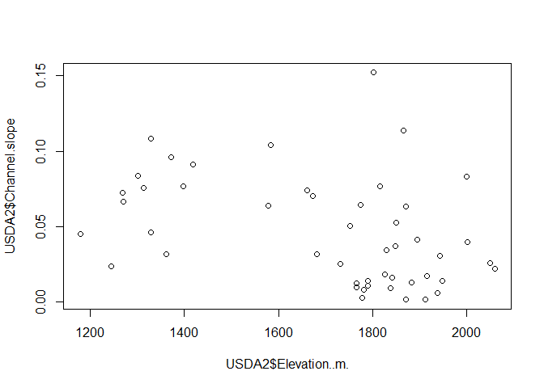

CH6 part4 Linear Regressions
================
Nurrospody
8/17/2020, *Learn R for Applied Statistics : With Data Visualizations,
Regressions, and Statistics*

  - [Linear Regression *lm(), hist(),
    summary()*](#linear-regression-lm-hist-summary)
      - [Testing for normality](#testing-for-normality)
      - [Spearman’s rank correlation test *“ggpubr”,
        cor.test()*](#spearmans-rank-correlation-test-ggpubr-cor.test)
  - [Multiple Linear Regression *cor(), plot(), hist(), reformatting
    xlxs
    sheet*](#multiple-linear-regression-cor-plot-hist-reformatting-xlxs-sheet)
  - [Multiple Linear Regression Take 2 *plot(), png(), dev.off(), par(),
    linear plot
    later*](#multiple-linear-regression-take-2-plot-png-dev.off-par-linear-plot-later)

### Linear Regression *lm(), hist(), summary()*

With a linear regression, we can test for a linear relationship between
one independent variable and one dependent variable.  
I’m going to Arc’s friendship bonus data, and test for if `FB$Stage`
(independent variable) has any linear relationship with `FB$StagesSince`
(dependent variable). The research question is: If the Stage number is
higher, do friendship bonuses occur more often?  
The null hypothesis is that there is no linear relationship; the
alternate hypothesis is that the number of a stage has a statistically
significant effect on the stages since a friendship bonus was received.

#### Testing for normality

In a previous excercise, I had already used
`shapiro.test(FB$StagesSince[2:31])` to test for normality (I could not
find normality, presumably because of n30); I had also already used
`skewness(FB$StagesSince[2:31])` to test for normality of skew.  
However, this time I will instead use a histogram and linear plot to
test for linearity.

``` r
hist(FB$StagesSince); plot(StagesSince ~ Stage, data = FB)
```

<!-- --><!-- -->

The histogram appears to be relatively normal; however, we can see with
the basic plot that no linear relationship exists between the two
variables. **We can immediately fail to reject the null hypothesis**.

For the sake of this excercise, though, I will complete the linear
analysis so that I can use the commands.

``` r
#lm(Dependent variable ~ independent variable)  
StageNum.StagesSince.lm <- lm(StagesSince ~ Stage, data = FB)
summary(StageNum.StagesSince.lm)
```

    ## 
    ## Call:
    ## lm(formula = StagesSince ~ Stage, data = FB)
    ## 
    ## Residuals:
    ##     Min      1Q  Median      3Q     Max 
    ## -4.5471 -0.5696  0.1390  1.4143  3.6118 
    ## 
    ## Coefficients:
    ##             Estimate Std. Error t value Pr(>|t|)    
    ## (Intercept)  8.72046    0.88139   9.894 1.22e-10 ***
    ## Stage       -0.01444    0.01384  -1.044    0.306    
    ## ---
    ## Signif. codes:  0 '***' 0.001 '**' 0.01 '*' 0.05 '.' 0.1 ' ' 1
    ## 
    ## Residual standard error: 2.184 on 28 degrees of freedom
    ##   (2 observations deleted due to missingness)
    ## Multiple R-squared:  0.03745,    Adjusted R-squared:  0.003073 
    ## F-statistic: 1.089 on 1 and 28 DF,  p-value: 0.3055

In the summary, we see our model equation, standard error, t-value, and
p-value.  
(Intercept) is the y-intercept of the regression equation, but because
there is no linear relationship it doesn’t matter here. Othewise, we
could use this data to predict where points that we don’t have may fall
within our range of variables. (Predicting outside sometimes works, but
can also be completely wrong, such as with income/happiness data.)

Our p-value for Stage is 0.306–much greater than alpha 0.05. We fail to
reject our null hypothesis that there is no linear relationship.

#### Spearman’s rank correlation test *“ggpubr”, cor.test()*

This is the non-parametric test that can be run for data that does not
fulfil the normality requirements (or similar variance requirements aka
homoscedasticity) for the parametric linear regression test.  
We would need to `install.packages("ggpubr")`, load the library
`library("ggpubr")`, and then use the function `cor.test()` rather than
lm() which we used for the parametric test. I have inferred from the gg-
in front of the package name that this is related to the ggplot
package\!

### Multiple Linear Regression *cor(), plot(), hist(), reformatting xlxs sheet*

With multiple linear regression, we can test for linear relationships
between multiple independent variables and one dependent variable.  
Since the data that I used before didn’t have any linear correlation, I
found a [USDA Ag Data Commons
dataset](https://data.nal.usda.gov/dataset/stream-temperature-modeling-and-monitoring-multiple-regression-stream-temperature-model)
about stream tempurature since it seemed promising. I downloaded the
Example Data that was available.  
First, let’s test for normalcy and linearity with a few variables. Let’s
also try to remember that when plotting, the order should still be
(dependent \~ independent) variable. The plot will tell us its story
either way, but it’s good practice to always put them in the order that
some functions require them to be in.  
The headers used to be multi-tiered and make these two variables
`Predictor.Variables..X.s.` (Elevation) and `NA..3` (Slope) but I didn’t
feel like messing with buggy variables and lack of numerical data which
I need for cor(), so I just deleted some unnessesary rows in the excel
sheet. I’m sure there’s ways to finagle this with fancy datasheets, but
this ain’t a fashion contest guys; we shouldn’t be making datasheets
pretty with extra cells. This was the same kind of issue I got when
using Madoka data in my first dataset ever.

Let’s test for hidden correlations first in independent variables. I’ll
use Elevation and Channel Slope as my independent variables first.

``` r
cor(USDA2$Elevation..m., USDA2$Channel.slope)
```

    ## [1] -0.3953729

\-0.3953729 is a pretty high correllation to just ignore, but I don’t
know much about the cor() function’s scale other than it going from
+-0.1. If we plot it, I should get a better subjective idea of how
correlated it actually is.

``` r
plot(USDA2$Elevation..m., USDA2$Channel.slope)
```

<!-- -->

this doesn’t look like anything to worry about, so I’ll just keep going
with the data. Now that I think about it, I think this is the scale
where a 0.8+- is important.

Next let’s pick a dependent variable. I have `Lake Crk`, `Fire Effect`,
and `Lake Effect` to choose from, but I need to find one with a normal
distribution . . . spoiler alert, none of them have a normal
distribution. They all look like this:

``` r
hist(USDA2$Fire.Effect)
```

<!-- -->

``` r
hist(USDA2$Lake.Effect)
```

<!-- -->

``` r
hist(USDA2$Lake.Crk)
```

<!-- -->

So that’s a bust. Let’s try a different dataset.

### Multiple Linear Regression Take 2 *plot(), png(), dev.off(), par(), linear plot later*

I obtained a [sample multiple linear regression data
set](https://www.scribbr.com/statistics/multiple-linear-regression/)
from scribbr, which has been a surprisingly helpful guide (more so than
my textbook recently) considering it’s mostly a site for writing.  
With the new dataset, our research question is: how do biking and or
smoking affect heart disease? Our null hypothesis is that neither change
the mean of heart disease, and our alternate hypothesis is that they do.

I’ve already shown getting cor() and hist() for proving if data is
usable for a Linear Regression test before, so let’s skip showing that
and move onto the next step.

Our next step is to make two linearity testing scatterplots using our
dependent variable (heart disease) and our two independent variables
(smoking and heart disease). Both times we have the order in (dependent
\~ independent).

``` r
plot(heart.disease ~ biking, data=heart); 
```

<!-- -->

``` r
plot(heart.disease ~ smoking, data=heart);
```

<!-- -->

They both appear linear, so we can continue. Funnily enough, when I
tested this out in the console before knitting my Rmd, I got a weird
combined plot that also looked linear.


Let’s test the relationship between these variables now.

``` r
heart.disease.lm<-lm(heart.disease ~ biking + smoking, data = heart)

summary(heart.disease.lm)
```

    ## 
    ## Call:
    ## lm(formula = heart.disease ~ biking + smoking, data = heart)
    ## 
    ## Residuals:
    ##     Min      1Q  Median      3Q     Max 
    ## -2.1789 -0.4463  0.0362  0.4422  1.9331 
    ## 
    ## Coefficients:
    ##              Estimate Std. Error t value Pr(>|t|)    
    ## (Intercept) 14.984658   0.080137  186.99   <2e-16 ***
    ## biking      -0.200133   0.001366 -146.53   <2e-16 ***
    ## smoking      0.178334   0.003539   50.39   <2e-16 ***
    ## ---
    ## Signif. codes:  0 '***' 0.001 '**' 0.01 '*' 0.05 '.' 0.1 ' ' 1
    ## 
    ## Residual standard error: 0.654 on 495 degrees of freedom
    ## Multiple R-squared:  0.9796, Adjusted R-squared:  0.9795 
    ## F-statistic: 1.19e+04 on 2 and 495 DF,  p-value: < 2.2e-16

The P-value for both of these values are statistically significant. But
what does this mean? It’s sensible to guess that biking and smoking do
not impact heart disease in the same exact way, so let’s look at another
number than just the p-value. If we look at Estimate, we see that
biking’s number is negativge, and smoking’s number is positive. This
means that biking has a negative impact on heart disease (as in, there
is less of it) and smoking has a positive impact on heart disease(as in,
there is more of it). Funny how we want a negative in this case\!

Next we want to test for homoscedasticity aka the variance does not vary
too much so that the linear model can do a good job. We could just use a
Q-Q test for this, but apparently you can make more graphs print in the
same space, and then plot a bunch of residual plots at oncde, and that’s
really cool\!\! So we’re going to try that here:

``` r
par(mfrow=c(2,2))
plot(heart.disease.lm)
```

<!-- -->

``` r
par(mfrow=c(1,1))
```

This is really super cool. I’ve never heard of Cook’s distance before,
but Residuals vs. Fitted and Normal Q-Q tell me that this will work well
on the linear model.  
If you do a regular `plot(heart.disease.lm)` without putting
`par(mfrow=c(2,2))` first, then only one plot is printed and you get the
message `Hit <Return> to see next plot:`. So multiple plots are already
built into the results from the lm() function, and that’s why we get
multiple plots.

Then, we could plot our results onto a linear model to share it. I’ll do
that tomorrow.

To continue reading the CH6 reports, select a new section:  
Next: [Part 5 of the Chapter 6
Reports](https://github.com/Nurrospody/SOURCE-Statistics-ILC/blob/master/Chapter%20Reports/CH6-part5.md)  
Previous: [Part 3 of the Chapter 6
Reports](https://github.com/Nurrospody/SOURCE-Statistics-ILC/blob/master/Chapter%20Reports/Ch6-part3.md)

[Link to README to select any Chapter
Report](https://github.com/Nurrospody/SOURCE-Statistics-ILC/blob/master/README.md)
