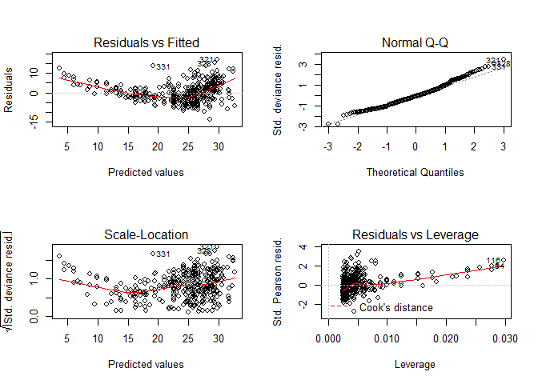

A Look into Resampling
================
Nurrospody
9/1/2020

  - [Resampling Intro](#resampling-intro)
      - [Resampling instead of validation
        method](#resampling-instead-of-validation-method)
      - [Using MSE to show that validation model may not work and we
        need
        resampling](#using-mse-to-show-that-validation-model-may-not-work-and-we-need-resampling)
  - [Leave-One-Out Cross-Validation Resampling
    (LOOCV)](#leave-one-out-cross-validation-resampling-loocv)
  - [k-fold Cross Validation](#k-fold-cross-validation)

### Resampling Intro

I’m using a [github.io resampling R
tutorial](https://uc-r.github.io/resampling_methods) for this report, as
my book does not cover the subject. See {r setup, include=FALSE} block
inside of the
(Rmd)\[<https://github.com/Nurrospody/SOURCE-Statistics-ILC/blob/master/Chapter%20Reports/September-2020-Resampling.Rmd>\]
for more information on new packages used in this report.

When we resample, we take one sample that we’ve gathered already and
then repeatedly refit a model of interest to it. We use our already
gathered sample as a “training set”. When we refit this model multiple
times, we get slightly different models–and we can compare how different
these models are to investigate the extent that our test results could
have differed. With resampling, we can get more information than we can
with just taking one sample. Often we pair resampling with linear
regression models.

#### Resampling instead of validation method

Resampling is an ‘alternative’ to something called the *validation* or
*hold out* approach, where data is split into a “training set” and
“testing/validation set”. In The validation approach, data is divided
40:60, respectively, to these two different sets.

When plotting our data, we want to know what model it fits best to. We
can use a loop test to test out 10 different models, from linear to 10th
degree polynomial. Then what we look for, when we plot this test, is
when our test error (MSE) flatlines after decreasing. When a test
flatlines, we see that adding extra polynomial degrees does not improve
the model preformance, and we want to stop there.

#### Using MSE to show that validation model may not work and we need resampling

The MSE is dependent on what particular data is in our training and
validation samples. For some datasets, it’s not important nessesarily
which data is in which sets; but for other datasets, it’s *very*
important. If we use the Auto dataset from the ISLR package, and do the
MSE test 10 times, we can see a problematically wide range of MSE
estimates when we use the validation test.

This plot, from the source I’m using as my tutorial, displays how wide
the MSE for the `Auto` dataset varies based on what’s in and what’s not
in each different sample set. Thus, we decide to use resampling methods
instead.


### Leave-One-Out Cross-Validation Resampling (LOOCV)

LOOCV works similarly to the validation model, but instead of the split
being 60:40 for training:validation, it’s instead n-1:1 for the training
and validation set. Then we use a loop function to repeat this n-1:1
training set for each individual data point. LOOCV works well for
datasets that are smaller, in the low hundreds.  
Like in
[Ch6-part4](https://github.com/Nurrospody/SOURCE-Statistics-ILC/blob/master/Chapter%20Reports/Ch6-part4.md)
[(Rmd)](https://github.com/Nurrospody/SOURCE-Statistics-ILC/blob/master/Chapter%20Reports/Ch6-part4.Rmd),
we’re using a linear model function. But unlike in Ch6-4, we’re using
`glm`instead of `lm`. This is because `glm` has built-in functions for
bootlegging that `lm` does not.

``` r
#First, we need to fit our Auto dataset to a glm linear model.
fit.glm <- glm(mpg ~ horsepower, data = Auto)  

#Then, we can use a LOOCV function on the dataset now that it's fit to a glm.  
loocv.auto <- cv.glm(Auto, fit.glm)
```

Just like in Ch6-4, we can pull 4 different linear models from our
result. Our QQ plot looks very nicely linear.

``` r
par(mfrow=c(2,2))
plot(fit.glm)
```

<!-- -->

``` r
par(mfrow=c(1,1))
```

But what we want to look at is the structure of our Auto LOOCV;
specifically the DELTA: the cross-validation estimate prediction error.

``` r
str(loocv.auto)
```

    ## List of 4
    ##  $ call : language cv.glm(data = Auto, glmfit = fit.glm)
    ##  $ K    : num 392
    ##  $ delta: num [1:2] 24.2 24.2
    ##  $ seed : int [1:626] 10403 1 2032810606 1127005209 1796948139 -1752529766 -1115958180 567177567 -2133675211 -2092640564 ...

We want to look at the first number for now, because we’re not mapping
it across multiple polynomial fits yet. If we were, we’d want to pick
whichever pick had the lowest number. The next step of my tutorial does
that, so let’s check it out. They create a function that loops LOOCV
through 5 different polynomial fits, and use the purrr library to use
that function. I’ll try using it here, too:

``` r
#This function is computing the test error for LOOCV when it's specifically using the first polynomial model.  That's what the [1] at the end after $delta is.
 loocv_err <- function(x) {
  fit.glm <- glm(mpg ~ poly(horsepower, x), data = Auto)
  cv.glm(Auto, fit.glm)$delta[1]
 }
#Then, we want to use that function with the purrr library, and loop t so that it does 1:5 polynomial degrees.  I require the purrr library earlier in the first {r} block.\
1:5 %>% map_dbl(loocv_err)
```

    ## [1] 24.23151 19.24821 19.33498 19.42443 19.03321

The numbers that we see here are expected MSE (test error) when using
different linear(1), quadratic(2), or polynomial(3+) fits. The first
number is significantly higher than the second, but the second is not
significantly different than 3, 4, or 5. What we can infer here is that
the quadratic fit is probably best when we graph our training+resampled
data.  
Because the disadvantage of LOOCV is that it would take a very long time
to compute for large sample sizes, let’s look at another test.

### k-fold Cross Validation
