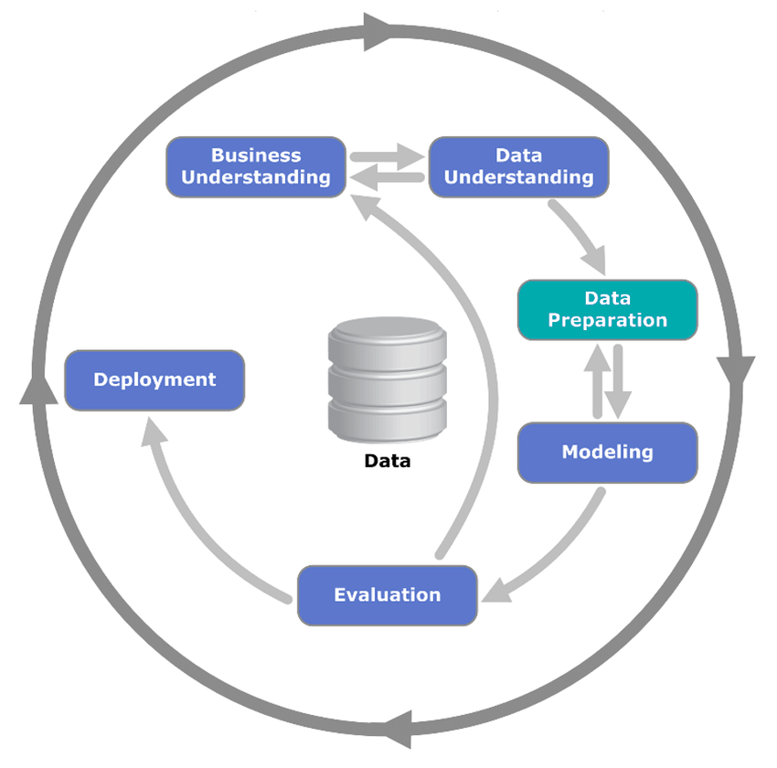

Vocabulary, Basic Maths, & Basic Scripts: Chapter 3 *Learn R for Applied
Statistics : With Data Visualizations, Regressions, and Statistics*
(Started Week 2 Monday)
================
Nurrospody
4/6/2020

  - [Notable Vocabulary from Chapter
    3](#notable-vocabulary-from-chapter-3)
  - [Writing in R Console - Basic Mathematics *Comands Used* :
    subraction, addition, division, multiplication, cosine, sine,
    tangent, standard deviation, mean, min, max,
    plot](#writing-in-r-console---basic-mathematics-comands-used-subraction-addition-division-multiplication-cosine-sine-tangent-standard-deviation-mean-min-max-plot)
  - [Making a basic script](#making-a-basic-script)

This chapter is very long. For ease of work and browsing I have
seperated this chapter into seperate reports, roughly based on the
amount of content showed per section.

### Notable Vocabulary from Chapter 3

**CRISP-DM** (also Data Mining) - This is a model of data understanding
(statistics, machine learning, etc) and buisness understanding (real
world practices, what the data means for a company, how people react).
The data-understanding folks work together with the
buisness-understanding folks to prepare the data and model it; once it’s
put into a model, it’s evaluated by both parties to make sure it makes
sense. If both parties are happy, the model is deployed. “Because data
science is a multidisciplinary field, if you can master statistics,
machine e-learning, and business knowledge, it is extremely hard to be
replaced.” Direct quote from page 6. 

**R Objects** - Everything inside of R is an object, and an R Object is
an object inside of R. An object is any data structure with any
attributes that can have action done unto them with some sort of method.

**Variables** - AKA. Variable is variable (python), something that is
defined and then can be used in the console.

**Data Types** - What a data’s classification is–numeric, character,
TRUE/FALSE.

**Vectors** - A data structure for storing a SET of data values of the
SAME type. The most basic and common data structure. If stored with
extra attributes, like dim, it is technically an ‘array’ and not a
vector.

**Lists** - Like a vector, a list can store a SET of values, but it can
store values of DIFFERENT data types in a single list.

**Matrix** - Stores data in a ‘two dimensional’ table rather than a
one-dimensional list. All data must of the SAME type. Uses dimnames to
label each axis of the table.

**Data Frames** - Stores data in a ‘two dimensional’ table; can be of
DIFFERENT types. Usually stores data imported from EXCEL or .csv. Uses
dimnames to label axes of the table.

**Conditional Statements** - These are boolean expressions; *if . . .
else* statements; basic TRUE FALSE backbones of a code that make things
work. They use mathematical expressions like \!= does not equal; ==
equal to; \<= less than or equal to.

**Loops** - Loops are \*for \[p\] in \[variable\]\*\* statements that
apply *something* to each element inside of a vector. These are useful
because, rather than manually doing the same operation multiple times,
you can tell the console to do this operation multiple times before
ending the operation. Some operations cannot be done on a whole vector,
but they can be done on elements within a vector.

**Functions** - If you wanted to run the same fragment of code on
multiple variables, you can take that code fragment and give it a name.
Then when you want to use that code, you can use its name (like you do a
variable’s name) rather than typing it out every time you want to use
it. R has many built in functions; mean() is a function. Instead of
taking every number, adding it up, and dividing . . . simply use the
function.

**\<-** - “Assign”

**c() OR cat()** - concatenate; combine;

| Data Types        | Example Values                         |
| ----------------- | -------------------------------------- |
| Logical (Boolean) | TRUE/FALSE (CAPS sensitive command)    |
| Numeric           | 1(integer), 1.0(double), 0.33(double)  |
| Character         | “This is a bat” (quotes are mandatory) |

### Writing in R Console - Basic Mathematics *Comands Used* : subraction, addition, division, multiplication, cosine, sine, tangent, standard deviation, mean, min, max, plot

I discovered that if I use semi-colons to mark the end of a line
delimiter but DON’T break the line wtih ENTER, it compiles the
information in a way that is more legible for an RMarkdown report.

``` r
47-50; 89+6; 5 * 8; 54/870
```

    ## [1] -3

    ## [1] 95

    ## [1] 40

    ## [1] 0.06206897

``` r
cos(96); sin(96); tan(96)
```

    ## [1] -0.1804304

    ## [1] 0.9835877

    ## [1] -5.45134

Before solving for the standard deviation as-per the book’s example, I
noticed that a ‘c’ was part of the formula, but wasn’t sure why. I
experimented a bit with not including it, and realized that without c
only the first value is used; c appears to be ‘concatenate’, to
‘combine’ something into a list. The help() page called it a
‘Primitive’ function.

``` r
sd(c(7,81,4,53,82,11,90, na.rm = FALSE)); mean(c(111, 65, 78, 93, 299)); min(c(9, 4, 7, 2)); max(c(9, 7, 2, 5))
```

    ## [1] 39.51853

    ## [1] 129.2

    ## [1] 2

    ## [1] 9

``` r
plot(c(77, 45, 99, 88, 33))
```

<!-- -->

### Making a basic script

Using information from the sections ‘Using the Code Editor’ and ‘Adding
Comments to the Code’ I made the following simple RScript. \#Can be used
to add a comment to a script, which is very helpful\! The first part of
the script assigns variables and then some math uses those assigned
variables.  
I discovered that you can use = instead of \<-, but apparently \<- works
on all levels of coding and = only works in the first level of code? Not
sure what code levels mean yet, but using \<- for R seems generally god
practice.

``` r
#Create Variable "A" with a value of "1"
A <- 1;
#Create Variable "B" with a value of "2"
B <- 2;

#Do mathematical functions with variables "A" & "B" (division, multiplication, addition, subtraction)
A/B; A * B; A + B; A - B;
```

    ## [1] 0.5

    ## [1] 2

    ## [1] 3

    ## [1] -1

``` r
#Square variables "A" and "B" on two seperate lines
A^2; B^2;
```

    ## [1] 1

    ## [1] 4
